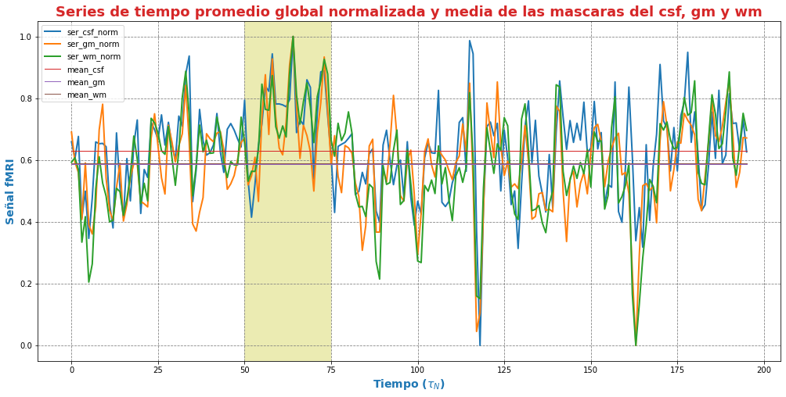
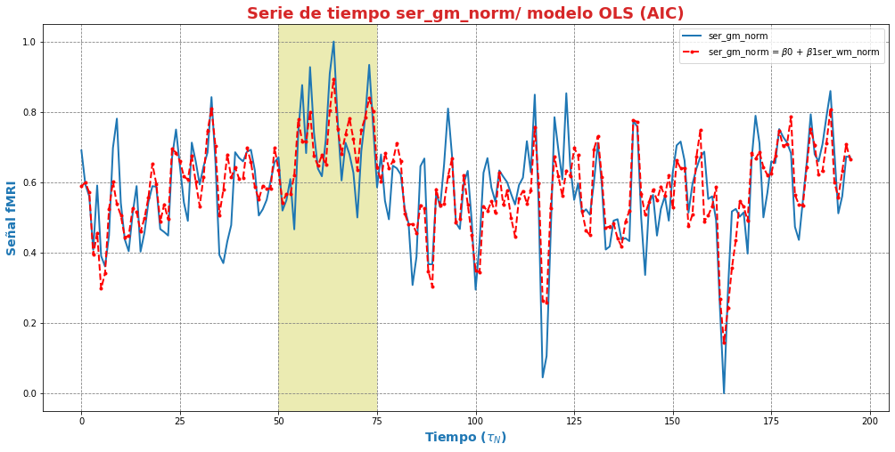
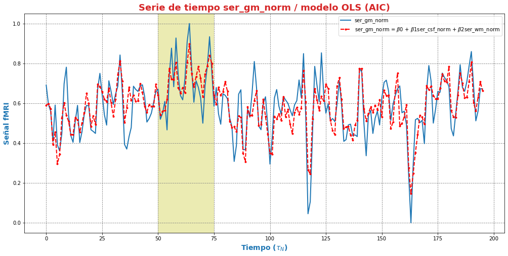
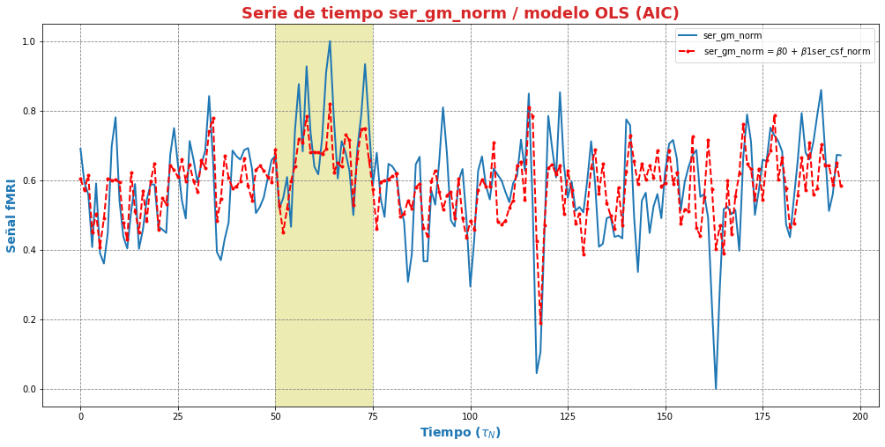
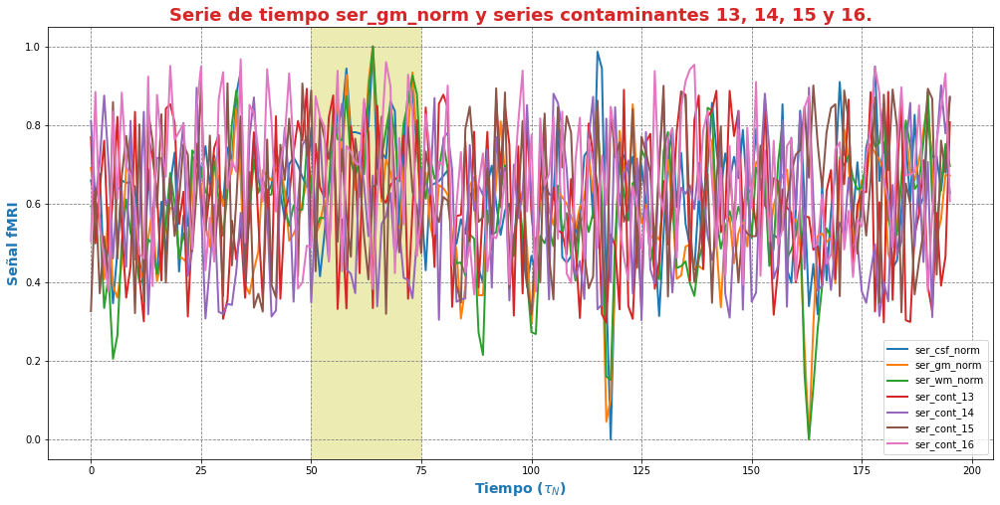
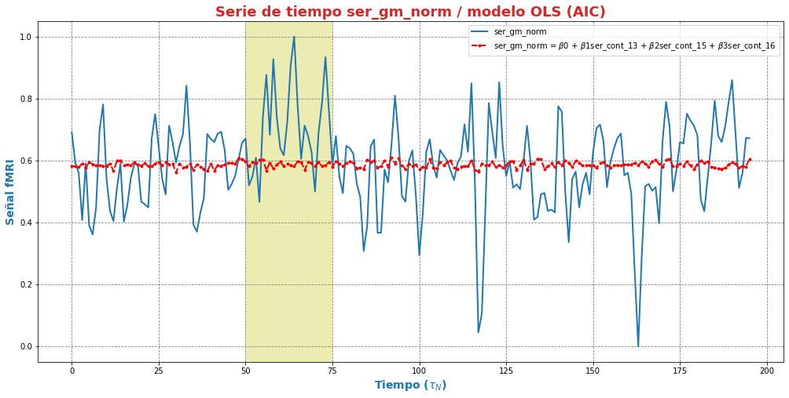

---

---

***Andres Eduardo Aracena Rangel***

*Estudiante del programa del Magister en Física Médica*

---

---


El siguiente Script de Python forma parte del trabajo especial de grado.

Profesora Guía:

*PhD María Daniela Cornejo*

---

---

&nbsp;
Con referencia:

- [Pagina oficial NIbabel](https://nipy.org/nibabel/index.html) 

Imagenes de fMRI extraidas de OpenNuero:
 
 - [ds002422](https://openneuro.org/datasets/ds002422/versions/1.1.0)
 
---

---

 Acronimos:

- CSF: Cerebrospinal Fluid (*líquido cefalorraquídeo*)
- GM: Gray Matter (*materia gris*)
- WM: White Matter (*materia blanca*)

---

---

NOTA:
Cuando indiquemos imagenes brain o mascaras brain, nos estamos refieriendo a las imagenes o mascaras de csf, wm, gm

---

---

# Modelos de regresión lineal múltiple en series del tejido cerebral - Normalizados

## Importamos librerias


```python
import time # medir el tiempo de ejecución de nuestros programas
start = time.process_time()
inicio = time.time()
```


```python
import os # El módulo os nos permite acceder a funcionalidades dependientes del Sistema Operativo
from os.path import join as opj   # Este método concatena varios componentes de ruta con exactamente un separador de directorio(‘/’)
import matplotlib.pyplot as plt   # Permite la generación de gráficos
import pandas as pd               #Biblioteca para manipulación de marcos de datos
import numpy as np
from numpy import random

#Biblioteca para estimar modelos estadísticos y realizar pruebas estadísticas
import statsmodels.api as sm
```

## Definimos parámetros


```python
'''
Ruta donde reposan las series promedios 'brain' y 'series aleatorias' en archivo csv
'''
path_series = '/home/aracena/thesis_ds002422/04_fase2_promedio_series_tiempo_brain/output/0.95/archivos_csv/' 

'''
Ruta donde se guardaran resultados
'''
path_exp = '/home/aracena/thesis_ds002422/07_fase3_validacion_aic_regre_lin_ser_brain_norma/'
path_out = opj(path_exp, 'output')
path_png = opj(path_out, 'archivos_png')

'''
Creamos la carpeta de salida
'''
os.system('mkdir -p %s'%path_out);
os.system('mkdir -p %s'%path_png);
```

## Funciones

### Función para graficar series de tiempo


```python
'''
Función grafica las series de tiempo de una DF introducida. Se requiere input:

- df_data = Dataframe que contiene las series de tiempo
- name_save = nombre con que desea guardar el grafico
'''

def plot_series_time(df_data, resaltar, titulo, name_save): 
    # Creamos una lista con las claves del diccionario ingresado
    tejido = list(df_data.keys())
    # definimos una ventana
    vent_min = 50
    vent_max = 75


    font1 = {'fontsize':14, 'fontweight':'bold', 'color':'tab:blue'}
    font2  = {'fontsize':18, 'fontweight':'bold', 'color':'tab:red'}

    fig, ax = plt.subplots(figsize = (17,8))
    for i,tisue in enumerate(tejido):
        if resaltar[0] == 'all':
            ax.plot(df_data[tisue], linewidth=2, label=tisue)
        elif i < len(resaltar):
            ax.plot(df_data[resaltar[i]], linewidth=2, label=tisue)
        else:           
            ax.plot(df_data[tisue], linewidth=1, label=tisue)

    ax.legend()
    ax.set_xlabel('Tiempo ($\\tau_N$)',fontdict=font1)
    ax.set_ylabel('Señal fMRI',fontdict=font1)
    ax.set_title(titulo, fontdict = font2)
    ax.grid(axis = 'x', color = 'gray', linestyle = 'dashed')
    ax.grid(axis = 'y', color = 'gray', linestyle = 'dashed')
    ax.axvspan(vent_min,vent_max, alpha=0.3, facecolor='y')

    plt.savefig(opj(path_png, name_save))
```

### Función crear lista de las series de un DF (lista de los valores de la columna del DF) y eliminar series


```python
'''
Función  que extrae una lista de los valores de las columnas de un dataframe.

Inputs:

- df: Dataframe que se desea extrae una lista de los valores de las columnas,
- elmiminar: lista de los valores de las columnas del DF que desea eliminar. Se debe ingresar una lista:
        * NO eliminar ningun valor de las columnas DF --> ['none']
        * Elimimnar uno o mas valores de la lista --> ['nombre_1' , 'nombre_2']
        
        LOS VALORES DEBE ESTAR EN FORMATO STRING (entre comillas simples o dobles)

Output:

- list_series: lista de series del DF
'''

def lista_dataframe(df, eliminar):
    # Creamos una lista de las columnas del dataframe
    series = df.columns.values
    list_series = list(series)
    
    tam = len(eliminar)

    if tam == 1:
        if eliminar[0] == 'none':
            list_series
        else:
            list_series.remove(eliminar[0]) 
    if tam != 1:   
        for i in range(tam):
            list_series.remove(eliminar[i])        
    
    return list_series    
```

### Función de conjunto potencia ó de número de combinaciones

En matemáticas, dado un conjunto $S$, se llama conjunto potencia o conjunto de partes de $S$ (se denota por $P(S)$ o $2^S$) al conjunto formado por todos los subconjuntos posibles de $S$.

Por ejemplo, si $S= {a, b, c}$ entonces el conjunto potencia de $S$ es 

*P(S) = {{ }, {a}, {b}, {c}, {a, b}, {a, c}, {b, c}, {a, b, c} }*


```python
'''
Función para extraer todos los subconjuntos posibles de un conjunto de una lista de entrada.

Inputs:

- lista_conjunto: Lista donde se desea extraer el conjunto potencia
- columnas: Numero de columnas para ordenar las combinaciones/modelos

Output:

- r: Lista de las combinaciones/modelos.
'''

def potencia(list_conjunto):
    '''
    Calcula y devuelve el conjunto potencia del conjunto c.
    En matemáticas, el conjunto potencia de un conjunto dado es otro conjunto 
    formado por todos los subconjuntos del conjunto dado.
    '''
   
    # Número de combinaciones
    if len(list_conjunto) == 0:
        return [[]]
    r = potencia(list_conjunto[:-1])
    
    return r + [s + [list_conjunto[-1]] for s in r]
```

### Funcion para crear un dataframe de las combinaciones/modelos


```python
'''
Función para visualizar las combinaciones/modelos en un dataframe, para ser incorporada en documentos.

Inputs:

- lista_combi: Lista de combinaciones/modelos 
- columnas: Numero de columnas para ordenar las combinaciones/modelos

Output:

- df_combi: Dataframe con las combinaciones/modelos
'''


def crear_df_combi(lista_combi, columnas):
    combi = lista_combi
    '''
    ordenamos la lista
    '''
    combi.sort()
    
    '''
    Se reescribe el elemento lista de la lista en un solo valor, 
    que es la combinacion/modelo
    '''

    list_combi =[]
    beta = str('$\\beta$')
    for i, co in enumerate(combi):
        modelo= beta+str(0)
        for j, mo in enumerate(combi[i]):
            modelo = modelo + ' + ' + beta + str(j+1) + ' ' + mo
        list_combi.append(modelo)   
    
    '''
    PROCESO DE CONVERTIR DE LISTA 1D A UN DATAFRAME FIL X COLUM
    '''
    # Indique cuantas columnas quiere representar las combinaciones en un DF
    colum = columnas

    # Como se quiere crear una matriz de 'colum' columnas, 
    # verifico si 'long' es divisible entre 'colum'; de no ser serlo, 
    # agrego un elemneto vacio a la lista hasta conseguirlo
    long = len(list_combi)
    n=0
    while n==0:
        if long % colum == 0: 
            n=1
        else:
            list_combi.append('')
            long = len(list_combi)
            
    # Conviertimos la lista en un array
    co = np.array(list_combi)

    # Conviertimos un array de 1D a laa dimension fil x colum
    fil = int(long/colum) # numero de filas

    co = co.reshape(fil,colum)

    # Convertirmos la matriz fil x colum en un DF
    df_combi = pd.DataFrame(co)

    '''
    Cambiamos nombre de columnas
    '''
    #Creamos lista de nuevos nombres
    new_colum = []
    for i in range(colum):
        new_colum.append('Combinaciones / Modelos')

    df_combi.columns = new_colum

    '''
    Renombramos indice
    '''
    #Creamos diccionario de nuevos indices
    new_index = {}
    for i in range(fil):
        new_index[i]= ' '

    #renombramos indices
    df_combi.rename(index=new_index, inplace=True)
    
    return df_combi    
```


```python
'''
Función para visualizar las combinaciones/modelos en un dataframe, para ser incorporada en documentos.

Inputs:

- lista_combi: Lista de combinaciones/modelos 
- columnas: Numero de columnas para ordenar las combinaciones/modelos

Output:

- df_combi: Dataframe con las combinaciones/modelos
'''


def crear_df_combi_1(lista_combi, columnas):
    '''
    ordenamos la lista
    '''
    combi.sort()
    
    '''
    Se reescribe el elemento lista de la lista en un solo valor, 
    que es la combinacion/modelo
    '''
    le = len(combi)
    list_combi =[]
    for i, co in enumerate(combi):
        ser = co
        w = len(ser)
        for i, se in enumerate(ser):
            if i == 0:
                agr = se
            else:
                agr = agr + ' + ' + se
        list_combi.append(agr)
        
    '''
    PROCESO DE CONVERTIR DE LISTA 1D A UN DATAFRAME FIL X COLUM
    '''
    # Indique cuantas columnas quiere representar las combinaciones en un DF
    colum = columnas

    # Como se quiere crear una matriz de 'colum' columnas, 
    # verifico si 'long' es divisible entre 'colum'; de no ser serlo, 
    # agrego un elemneto vacio a la lista hasta conseguirlo
    long = len(list_combi)
    n=0
    while n==0:
        if long % colum == 0: 
            n=1
        else:
            list_combi.append('')
            long = len(list_combi)
            
    # Conviertimos la lista en un array
    co = np.array(list_combi)

    # Conviertimos un array de 1D a laa dimension fil x colum
    fil = int(long/colum) # numero de filas

    co = co.reshape(fil,colum)

    # Convertirmos la matriz fil x colum en un DF
    df_combi = pd.DataFrame(co)

    '''
    Cambiamos nombre de columnas
    '''
    #Creamos lista de nuevos nombres
    new_colum = []
    for i in range(colum):
        new_colum.append('Combinaciones / Modelos')

    df_combi.columns = new_colum

    '''
    Renombramos indice
    '''
    #Creamos diccionario de nuevos indices
    new_index = {}
    for i in range(fil):
        new_index[i]= ' '

    #renombramos indices
    df_combi.rename(index=new_index, inplace=True)
    
    return df_combi    
```

### Función aplicacion modelo OLS


```python
'''
df_analisis: Dataframe que contien la serie dependiente (variable dependiente o variable de respuesta)
                y las series predictoras (ariables independientes o variables predictoras)
var_depen: Variable dependiente del dataframe (serie a predecir)
modelo: modelo a predecir la variable dependiente

Output: 

aic, r2, r2_adj, model: estadistios
'''


def estadisticos(df_analisis, var_depen, modelo):
    # Y: normalmente significa la variable respuesta (variable dependiente o variable de respuesta)
    #define response variable
    Y = df_analisis[var_depen]

    # X: usualmente significa nuestras variables de entrada (variables independientes o variables predictoras)
    X = df_analisis[modelo]

    #agregar constante a las variables predictoras [intercepción (beta_0) al modelo]
    X = sm.add_constant(X)

    #ajustamos modelo de regresión
    model = sm.OLS(Y, X).fit()    # sm.OLS(respuesta, entrada)

    #guardamos estadisticos AIC, R2, R2-AJUSTADO
    aic = model.aic
    r2 = model.rsquared
    r2_adj = model.rsquared_adj
    
    return aic, r2, r2_adj, model
```

### Función para determinar el mejor modelo mediante modelo de regresión OSL


```python
def best_osl(df_depen, df_indep, var_depen, lista_combi):
    num_ser = df_depen.shape[1]

    a = pd.DataFrame()
    b = pd.DataFrame()
    aa = pd.DataFrame()
    bb = pd.DataFrame()
    aaa = pd.DataFrame()
    bbb = pd.DataFrame()
    for i in range(num_ser):
        #creamos una lista que identifica la serie del voxel, con la camtidad de combinaciones
        serie = []
        for j in enumerate(lista_combi):
            serie.append(i)
        #se crea dataframe que identifica voxel en estudio
        df_serie = pd.DataFrame(serie, columns=['serie'])

        #extraemos la serie de tiempo del voxel i
        serie_estudio = df_depen.iloc[:,[i]]
        serie_estudio.columns=[var_depen]

        analisis = pd.merge(serie_estudio, df_indep,
                               right_index=True,left_index=True)

        #Ejecutamos la funcion aic
        RESULTADO_AIC = {}
        RESULTADO_R2 = {}
        RESULTADO_R2_AJU = {}
        modelo = {}
        for i, c in enumerate(lista_combi):
            li = lista_combi[i]
            anali = estadisticos(df_analisis=analisis,
                                 var_depen= var_depen,
                                 modelo=li)
            AIC = round(anali[0],2)
            R2 = round(anali[1],4)
            R2_AJU = round(anali[2],4)        
            c = ','.join(c)
            RESULTADO_AIC[c] = AIC
            RESULTADO_R2[c] = R2
            RESULTADO_R2_AJU[c] = R2_AJU
            modelo[c] = anali[3]


        '''
        DataFrame AIC
        '''
        #representamos el resultado aic en un dataframe
        DF_AIC = pd.DataFrame(list(RESULTADO_AIC.items()),
                       columns=['MODELO', 'AIC'])

        #representamos el resultado del modelo(resultado de la regresión
        # lineal) en un dataframe
        DF_MODELO = pd.DataFrame(list(modelo.items()),
                       columns=['MODELO', 'resultado_regresión'])

        # Unimos DF de resultado aic con DF modelo
        DF_AIC = pd.merge(DF_AIC,DF_MODELO, on='MODELO')

        #ordenamos de mayor a menor
        DFM_AIC = DF_AIC.sort_values('AIC')

        #restablecer el índice (para poder eliminar luego los dos ultimos)
        DFM_AIC.reset_index(drop=True, inplace=True)

        #unimos DFM con la identificacion del voxel
        best_model_aic = pd.merge(df_serie, DFM_AIC,
                           right_index=True,left_index=True)

        #elegimos el mejor modelo del voxel en estudio
        be = 1
        en =  len(lista_combi)
        best_aic = best_model_aic.drop(range(1, en, 1),axis=0)

        if i == 0:
            # creamos a y b para concatenar los demas resultados
            a = best_model_aic
            b = best_aic
        else:
            best_model_aic = pd.concat([a, best_model_aic])
            best_aic = pd.concat([b, best_aic])
            a = best_model_aic
            b = best_aic

        #restablecer el índice
        best_model_aic.reset_index(drop=True, inplace=True)
        best_aic.reset_index(drop=True, inplace=True)


        '''
        DataFrame R2
        '''

        #representamos el resultado aic en un dataframe
        DF_R2 = pd.DataFrame(list(RESULTADO_R2.items()),
                       columns=['MODELO', 'R2'])
        #representamos el resultado del modelo(resultado de la regresión
        # lineal) en un dataframe
        DF_MODELO_R2 = pd.DataFrame(list(modelo.items()),
                       columns=['MODELO', 'resultado_regresión'])

        # Unimos DF de resultado aic con DF modelo
        DF_R2 = pd.merge(DF_R2,DF_MODELO_R2, on='MODELO')


        #ordenamos de mayor a menor
        DFM_R2 = DF_R2.sort_values('R2',ascending=False)

        #restablecer el índice (para poder eliminar luego los dos ultimos)
        DFM_R2.reset_index(drop=True, inplace=True)

        #unimos DFM con la identificacion del voxel
        best_model_r2 = pd.merge(df_serie, DFM_R2,
                           right_index=True,left_index=True)

        #elegimos el mejor modelo del voxel en estudio
        be = 1
        en =  len(lista_combi)
        best_r2 = best_model_r2.drop(range(1, en, 1),axis=0)

        if i == 0:
            # creamos a y b para concatenar los demas resultados
            aa = best_model_r2
            bb = best_r2
        else:
            best_model_r2 = pd.concat([aa, best_model_r2])
            best_r2 = pd.concat([bb, best_r2])
            aa = best_model_r2
            bb = best_r2

        #restablecer el índice
        best_model_r2.reset_index(drop=True, inplace=True)
        best_r2.reset_index(drop=True, inplace=True)


        '''
        DataFrame R2-ajustado
        '''
        #representamos el resultado aic en un dataframe
        DF_R2_AJU = pd.DataFrame(list(RESULTADO_R2_AJU.items()),
                       columns=['MODELO', 'R2-ajus'])

        #representamos el resultado del modelo(resultado de la regresión
        # lineal) en un dataframe
        DF_MODELO_R2_AJU = pd.DataFrame(list(modelo.items()),
                       columns=['MODELO', 'resultado_regresión'])

        # Unimos DF de resultado aic con DF modelo
        DF_R2_AJU= pd.merge(DF_R2_AJU,DF_MODELO_R2_AJU, on='MODELO')

        #ordenamos de mayor a menor
        DFM_R2_AJU = DF_R2_AJU.sort_values('R2-ajus',ascending=False)

        #restablecer el índice (para poder eliminar luego los dos ultimos)
        DFM_R2_AJU.reset_index(drop=True, inplace=True)

        #unimos DFM con la identificacion del voxel
        best_model_aju = pd.merge(df_serie, DFM_R2_AJU,
                           right_index=True,left_index=True)

        #elegimos el mejor modelo del voxel en estudio
        be = 1
        en =  len(lista_combi)
        best_r2_aju = best_model_aju.drop(range(1, en, 1),axis=0)

        if i == 0:
            # creamos a y b para concatenar los demas resultados
            aaa = best_model_aju
            bbb = best_r2_aju
        else:
            best_model_aju = pd.concat([aaa, best_model_aju])
            best_r2_aju = pd.concat([bbb, best_r2_aju])
            aaa = best_model_aju
            bbb = best_r2_aju

        #restablecer el índice
        best_model_aju.reset_index(drop=True, inplace=True)
        best_r2_aju.reset_index(drop=True, inplace=True)

    return  best_aic, best_model_aic, best_r2, best_model_r2, best_r2_aju, best_model_aju, 
    #print(DFM_R2)
    #print('\n',best_model)
    #print('\n', best_aic)
```

### Función para extraer los valores p de los regresores


```python
'''
Función para extraer los valores p de las variables regresoras y su analisis con respecto al nivel 
significancia. Se requiere como inputs:

- df_ana = DF que se desea analisar y que debe contener los resultados de la regresión lineal
- nivel_signif = Nivel de significancia, si es de 5%, ingresamos 0.05, 
                                         si es del 10%, ingresamos 0.1, etc

Como output obtendremos un DF con el analisis sobre el valor p en los regresores
'''


def analisi_p(df_anali, nivel_signif):
    import pandas as pd
    '''
    Extraemos el primer indice de la DF a analizar. Esto se realiza, ya que en el analisis podremos escojer 
    los mejores aic de un conjunto de series que no empiece en el voxel/serie cero, por ejemplo, 
    puedo escojer los voxels del valor 4865 al 9728 que corresponden al segundo corte, y si utilizamos 
    el ciclo for desde 0, nos cambiara la identificación del voxel para para ser ingresado a la DF; 
    por ejemplo, el primer voxel al pasar por el ciclo es el 4865, y el ciclo lo guaradara 
    como 0
    '''

    inicio = df_anali.index.start

    '''
    Extraemos los valores p
    '''
    tam = len(df_anali)

    df_coef = pd.DataFrame()
    df_suma = pd.DataFrame()
    for i in range(tam):
        #extraemos resultados de la regresión lineal (RL) de las series de la imagen
        best_model = df_anali['resultado_regresión'][i+inicio]     
        indice = inicio + i
        #creamos DF de los valores p de la RL de la serie
        df_co = pd.DataFrame(round(best_model.pvalues,2)).T
        df_co.index = [indice]    

        #concatenamos
        df_coef = pd.concat([df_coef,df_co])

        #extraemos nombre de las columnas (regresores) en una lista; se extraee de la lista antes de concaenar
        regresores = df_co.columns.values  
        list_regresor = list(regresores)

        suma_evaluacion = 0
        valores_p = [] # creamos una lista para guardar los valores p y luego anexarla al DF best_aic

        for i, re in enumerate(list_regresor):
            coef = df_coef[re][indice]
            if coef < nivel_signif:
                suma_evaluacion = suma_evaluacion
            else:
                suma_evaluacion = suma_evaluacion + 1

            valores_p.append(coef)

        '''
        Agregamos el resultado de la lista de valores p de los regresores y 
        la suma_evaluación al DF en evaluación
        '''
        df_su = pd.DataFrame()
        df_su['valores_p_regresores'] = [valores_p]
        df_su['suma_evaluación'] = [suma_evaluacion]
        df_su.index = [indice]

        # concatenamos
        df_suma = pd.concat([df_suma,df_su])

    '''
    Unimos en un DF el resultado final
    '''
    analisis_p = pd.merge(df_coef, df_suma,
                       right_index=True,left_index=True)
    '''
    Unimos con la DF analisi_p con la DF de entrada
    '''
    best_p_1 = pd.merge(df_anali, analisis_p,
                           right_index=True,left_index=True)

    # eliminamos la columna resultado_regresión, 
    best_p = best_p_1.drop(['resultado_regresión'], axis=1)
    
    '''
    Crearemos un DF donde anexaremos una nueva columna, donde al evaluar suma_evaluacion si es 0, 
    agregamos el modelo AIC, si es mayor a cero, agregamos la palabra 'Pout', indicandonos que el
    modelo iene un valor p matyor a 0.05
    '''
    modelo_p = pd.DataFrame()

    for i in range(tam):
        valeva = best_p['suma_evaluación'][i+inicio]

        model_p = pd.DataFrame()
        if valeva == 0:
            model_p['MODELO_P'] = [best_p['MODELO'][i+inicio]]
        else:
            model_p['MODELO_P'] = ['Pout']

        model_p.index = [i+inicio]
        modelo_p = pd.concat([modelo_p,model_p])
    '''
    UNIMOS DF
    '''
    df_anali_p = pd.merge(best_p, modelo_p,
                     right_index=True,left_index=True)
    
    return df_anali_p
```


```python
'''
Función para extraer los valores p de las variables regresoras y su analisis con respecto al nivel 
significancia. Se requiere como inputs:

- df_ana = DF que se desea analisar y que debe contener los resultados de la regresión lineal
- nivel_signif = Nivel de significancia, si es de 5%, ingresamos 0.05, 
                                         si es del 10%, ingresamos 0.1, etc

Como output obtendremos un DF con el analisis sobre el valor p en los regresores
'''


def analisi_p_1(df_anali, nivel_signif):
    import pandas as pd
    '''
    Extraemos el primer indice de la DF a analizar. Esto se realiza, ya que en el analisis podremos escojer 
    los mejores aic de un conjunto de series que no empiece en el voxel/serie cero, por ejemplo, 
    puedo escojer los voxels del valor 4865 al 9728 que corresponden al segundo corte, y si utilizamos 
    el ciclo for desde 0, nos cambiara la identificación del voxel para para ser ingresado a la DF; 
    por ejemplo, el primer voxel al pasar por el ciclo es el 4865, y el ciclo lo guaradara 
    como 0
    '''

    inicio = df_anali.index.start

    '''
    Extraemos los valores p
    '''
    tam = len(df_anali)

    df_coef = pd.DataFrame()
    df_suma = pd.DataFrame()
    for i in range(tam):
        #extraemos resultados de la regresión lineal (RL) de las series de la imagen
        best_model = df_anali['resultado_regresión'][i+inicio]     
        indice = inicio + i
        #creamos DF de los valores p de la RL de la serie
        df_co = pd.DataFrame(round(best_model.pvalues,2)).T
        df_co.index = [indice]   

        #concatenamos
        df_coef = pd.concat([df_coef,df_co])

        #extraemos nombre de las columnas (regresores) en una lista; se extrae de la lista antes de concaenar
        regresores = df_co.columns.values  
        list_regresor = list(regresores)

        suma_evaluacion = 0
        valores_p = [] # creamos una lista para guardar los valores p y luego anexarla al DF best_aic
        
        # El la evaluación, no tomamos en cuenta el valor p de la constante
        for i in range(len(list_regresor)-1):            
            coef = df_coef[list_regresor[i+1]][indice]
            if coef < nivel_signif:
                suma_evaluacion = suma_evaluacion
            else:
                suma_evaluacion = suma_evaluacion + 1

            valores_p.append(coef)

        '''
        Agregamos el resultado de la lista de valores p de los regresores y 
        la suma_evaluación al DF en evaluación
        '''
        df_su = pd.DataFrame()
        df_su['valores_p_regresores_ser'] = [valores_p]
        df_su['suma_evaluación'] = [suma_evaluacion]
        df_su.index = [indice]

        # concatenamos
        df_suma = pd.concat([df_suma,df_su])

    '''
    Unimos en un DF el resultado final
    '''
    analisis_p = pd.merge(df_coef, df_suma,
                       right_index=True,left_index=True)
    '''
    Unimos con la DF analisi_p con la DF de entrada
    '''
    best_p_1 = pd.merge(df_anali, analisis_p,
                           right_index=True,left_index=True)

    # eliminamos la columna resultado_regresión, 
    best_p = best_p_1.drop(['resultado_regresión'], axis=1)
    
    '''
    Crearemos un DF donde anexaremos una nueva columna, donde al evaluar suma_evaluacion si es 0, 
    agregamos el modelo AIC, si es mayor a cero, agregamos la palabra 'Pout', indicandonos que el
    modelo iene un valor p matyor a 0.05
    '''
    modelo_p = pd.DataFrame()

    for i in range(tam):
        valeva = best_p['suma_evaluación'][i+inicio]

        model_p = pd.DataFrame()
        if valeva == 0:
            model_p['MODELO_P'] = [best_p['MODELO'][i+inicio]]
        else:
            model_p['MODELO_P'] = ['Pout']

        model_p.index = [i+inicio]
        modelo_p = pd.concat([modelo_p,model_p])
    '''
    UNIMOS DF
    '''
    df_anali_p = pd.merge(best_p, modelo_p,
                     right_index=True,left_index=True)
    
    return df_anali_p
```

### Función para graficar la variable dependiente en un modelo de OSL y el resultado del mejor modelo


```python
'''
Función para graficar la variable dependiente en un modelo de OSL y el resultado del mejor modelo 
mediante modelo de regresión OSL.

Inputs:

- df_depen = Dataframe de la variable dependiente del modelo de OSL 
- models_osl = Dataframe de los modelos de regresion al aplicar la funcion 'best_osl'. Ingresar solo
                el resultado segun alguno de los estadistico de AIC, R2 o R2_adjustado.
- best = seleccionar el modelo que quiere graficar. Si desea graficar el mejor modelo, se ingresa 0; 
        si desea graficar el segundo mejor modelo, se ingresa 1, y asi sucesivamente.
- titulo = titulo de la grafica
- name_save = nombre con el que se desea guardar la grafica
'''

def plot_series_osl(df_depen, models_osl, best, titulo, name_save): 
    '''
    Elegimos el modelo segun variable input best
    '''
    best_model= models_osl['resultado_regresión'][best]
    print(best_model.summary())
    
    '''
    Crear la etiqueta del mejor modelo
    '''

    for i, mo in enumerate(models_osl['MODELO'][best]):
        mo=models_osl['MODELO'][best].split(',') #Split regresa una lista de las palabras en la cadena, 
                                 # usando separador como el delimitador.

    '''
    Creamos nombre con los coeficientes y series del mejor modelo
    '''
    beta = str('$\\beta$')
    modelo_win = df_depen.columns.values[0]+' = '+beta+str(0)
    for i, m in enumerate(mo):
        modelo_win = modelo_win + ' + ' + beta + str(i+1) + m 
    
    '''
    Creamos etiqueta de la variable dependiente
    '''
    label_depen = df_depen.columns.values
    label_depen = label_depen[0]
    
    '''
    Dataframe del modelo de regresion OSL
    '''
    df_osl = pd.DataFrame(best_model.fittedvalues)
    df_osl.columns = ['modelo OLS']    
    
    # definimos una ventana
    vent_min = 50
    vent_max = 75


    font1 = {'fontsize':14, 'fontweight':'bold', 'color':'tab:blue'}
    font2  = {'fontsize':18, 'fontweight':'bold', 'color':'tab:red'}

    fig, ax = plt.subplots(figsize = (17,8))
    ax.plot(df_depen, linewidth=2, label=label_depen)
    ax.plot(df_osl, '--.', linewidth=2, color = 'red', label=modelo_win)

    ax.legend()
    ax.set_xlabel('Tiempo ($\\tau_N$)',fontdict=font1)
    ax.set_ylabel('Señal fMRI',fontdict=font1)
    ax.set_title(titulo, fontdict = font2)
    ax.grid(axis = 'x', color = 'gray', linestyle = 'dashed')
    ax.grid(axis = 'y', color = 'gray', linestyle = 'dashed')
    ax.axvspan(vent_min,vent_max, alpha=0.3, facecolor='y')

    plt.savefig(opj(path_png, name_save))
```

### Función para comparar los modelos segun los estadisticos AIC, R2 Y R2 ajustado


```python
'''
Función que genera un dataframe de comparacion de los modelos segun los estadisticos AIC, R2 Y R2 ajustado.

Inputs:

aic = DF modelos segun el estadistico AIC (DF resultante de la funcion 'best_osl')
r2 = DF modelos segun el estadistico R2 (DF resultante de la funcion 'best_osl')
r2_ajus = DF modelos segun el estadistico R2_ajus (DF resultante de la funcion 'best_osl')
'''

def compara_models_estad(aic,r2,r2_ajus):
    df_aic_best = aic_all.copy()
    df_aic_best = df_aic_best.drop(['serie', 'resultado_regresión'], axis=1)
    
    df_r2_best = r2_all.copy()
    df_r2_best = df_r2_best.drop(['serie', 'resultado_regresión'], axis=1)
    
    df_r2_aju_best = r2_ajus_all.copy()
    df_r2_aju_best = df_r2_aju_best.drop(['serie', 'resultado_regresión'], axis=1)
    
    df4 = pd.merge(df_aic_best,df_r2_best,on='MODELO',how='left')
    df5 = pd.merge(df4,df_r2_aju_best,on='MODELO',how='left')

    df5.style.highlight_max(axis=0)
    
    return     df5.style.\
                    highlight_max(subset=['AIC'], color='salmon').\
                    highlight_min(subset=['AIC'], color='yellow').\
                    highlight_max(subset=['R2','R2-ajus'], color='yellow').\
                    highlight_min(subset=['R2','R2-ajus'], color='salmon').\
                    format({'id':'{:.0f}'})
    
```

## Cargamos las series promedio global CSF, GM y WM.


```python
'''
Cargamos la serie del csf
'''
df_csf = pd.read_csv (opj(path_series,'serie_tiempo_norm_prom_ser_csf_norm.csv'))

'''
Cargamos la serie del gm
'''
df_gm = pd.read_csv (opj(path_series,'serie_tiempo_norm_prom_ser_gm_norm.csv'))


'''
Cargamos la serie del wm
'''
df_wm = pd.read_csv (opj(path_series,'serie_tiempo_norm_prom_ser_wm_norm.csv'))

'''
Unimos series csf, gm y wm en un dataframe
'''
df_series_brain = pd.merge(df_csf,df_gm,right_index=True,left_index=True)
df_series_brain = pd.merge(df_series_brain,df_wm,right_index=True,left_index=True)

df_series_brain.round(3)
```


<div>
<style scoped>
    .dataframe tbody tr th:only-of-type {
        vertical-align: middle;
    }

    .dataframe tbody tr th {
        vertical-align: top;
    }

    .dataframe thead th {
        text-align: right;
    }
</style>
<table border="1" class="dataframe">
  <thead>
    <tr style="text-align: right;">
      <th></th>
      <th>ser_csf_norm</th>
      <th>ser_gm_norm</th>
      <th>ser_wm_norm</th>
    </tr>
  </thead>
  <tbody>
    <tr>
      <th>0</th>
      <td>0.659</td>
      <td>0.691</td>
      <td>0.593</td>
    </tr>
    <tr>
      <th>1</th>
      <td>0.606</td>
      <td>0.594</td>
      <td>0.608</td>
    </tr>
    <tr>
      <th>2</th>
      <td>0.676</td>
      <td>0.560</td>
      <td>0.569</td>
    </tr>
    <tr>
      <th>3</th>
      <td>0.413</td>
      <td>0.408</td>
      <td>0.334</td>
    </tr>
    <tr>
      <th>4</th>
      <td>0.499</td>
      <td>0.591</td>
      <td>0.417</td>
    </tr>
    <tr>
      <th>...</th>
      <td>...</td>
      <td>...</td>
      <td>...</td>
    </tr>
    <tr>
      <th>191</th>
      <td>0.718</td>
      <td>0.687</td>
      <td>0.608</td>
    </tr>
    <tr>
      <th>192</th>
      <td>0.720</td>
      <td>0.512</td>
      <td>0.551</td>
    </tr>
    <tr>
      <th>193</th>
      <td>0.633</td>
      <td>0.561</td>
      <td>0.651</td>
    </tr>
    <tr>
      <th>194</th>
      <td>0.731</td>
      <td>0.673</td>
      <td>0.751</td>
    </tr>
    <tr>
      <th>195</th>
      <td>0.626</td>
      <td>0.672</td>
      <td>0.696</td>
    </tr>
  </tbody>
</table>
<p>196 rows × 3 columns</p>
</div>


### Extraemos la media de las series  *brain* 


```python
df_mean = pd.DataFrame(df_series_brain.mean())
df_mean.columns = ['mean']
df_mean.round(3)
```


<div>
<style scoped>
    .dataframe tbody tr th:only-of-type {
        vertical-align: middle;
    }

    .dataframe tbody tr th {
        vertical-align: top;
    }

    .dataframe thead th {
        text-align: right;
    }
</style>
<table border="1" class="dataframe">
  <thead>
    <tr style="text-align: right;">
      <th></th>
      <th>mean</th>
    </tr>
  </thead>
  <tbody>
    <tr>
      <th>ser_csf_norm</th>
      <td>0.631</td>
    </tr>
    <tr>
      <th>ser_gm_norm</th>
      <td>0.586</td>
    </tr>
    <tr>
      <th>ser_wm_norm</th>
      <td>0.590</td>
    </tr>
  </tbody>
</table>
</div>


### Creamos dataframe para graficar las series brain con la media


```python
df_mean_csf = pd.DataFrame()
```


```python
df_mean_csf = pd.DataFrame(columns = ['mean_csf'])

for i in range(df_series_brain['ser_csf_norm'].shape[0]):
    df_mean_csf = df_mean_csf.append({'mean_csf':df_mean['mean']['ser_csf_norm']},                
                   ignore_index = True) 
df_mean_csf
```


<div>
<style scoped>
    .dataframe tbody tr th:only-of-type {
        vertical-align: middle;
    }

    .dataframe tbody tr th {
        vertical-align: top;
    }

    .dataframe thead th {
        text-align: right;
    }
</style>
<table border="1" class="dataframe">
  <thead>
    <tr style="text-align: right;">
      <th></th>
      <th>mean_csf</th>
    </tr>
  </thead>
  <tbody>
    <tr>
      <th>0</th>
      <td>0.63076</td>
    </tr>
    <tr>
      <th>1</th>
      <td>0.63076</td>
    </tr>
    <tr>
      <th>2</th>
      <td>0.63076</td>
    </tr>
    <tr>
      <th>3</th>
      <td>0.63076</td>
    </tr>
    <tr>
      <th>4</th>
      <td>0.63076</td>
    </tr>
    <tr>
      <th>...</th>
      <td>...</td>
    </tr>
    <tr>
      <th>191</th>
      <td>0.63076</td>
    </tr>
    <tr>
      <th>192</th>
      <td>0.63076</td>
    </tr>
    <tr>
      <th>193</th>
      <td>0.63076</td>
    </tr>
    <tr>
      <th>194</th>
      <td>0.63076</td>
    </tr>
    <tr>
      <th>195</th>
      <td>0.63076</td>
    </tr>
  </tbody>
</table>
<p>196 rows × 1 columns</p>
</div>


```python
df_mean_gm = pd.DataFrame(columns = ['mean_gm'])

for i in range(df_series_brain['ser_gm_norm'].shape[0]):
    df_mean_gm = df_mean_gm.append({'mean_gm':df_mean['mean']['ser_gm_norm']},                
                   ignore_index = True) 
df_mean_gm
```


<div>
<style scoped>
    .dataframe tbody tr th:only-of-type {
        vertical-align: middle;
    }

    .dataframe tbody tr th {
        vertical-align: top;
    }

    .dataframe thead th {
        text-align: right;
    }
</style>
<table border="1" class="dataframe">
  <thead>
    <tr style="text-align: right;">
      <th></th>
      <th>mean_gm</th>
    </tr>
  </thead>
  <tbody>
    <tr>
      <th>0</th>
      <td>0.586474</td>
    </tr>
    <tr>
      <th>1</th>
      <td>0.586474</td>
    </tr>
    <tr>
      <th>2</th>
      <td>0.586474</td>
    </tr>
    <tr>
      <th>3</th>
      <td>0.586474</td>
    </tr>
    <tr>
      <th>4</th>
      <td>0.586474</td>
    </tr>
    <tr>
      <th>...</th>
      <td>...</td>
    </tr>
    <tr>
      <th>191</th>
      <td>0.586474</td>
    </tr>
    <tr>
      <th>192</th>
      <td>0.586474</td>
    </tr>
    <tr>
      <th>193</th>
      <td>0.586474</td>
    </tr>
    <tr>
      <th>194</th>
      <td>0.586474</td>
    </tr>
    <tr>
      <th>195</th>
      <td>0.586474</td>
    </tr>
  </tbody>
</table>
<p>196 rows × 1 columns</p>
</div>


```python
df_mean_wm = pd.DataFrame(columns = ['mean_wm'])

for i in range(df_series_brain['ser_wm_norm'].shape[0]):
    df_mean_wm = df_mean_wm.append({'mean_wm':df_mean['mean']['ser_wm_norm']},                
                   ignore_index = True) 
df_mean_wm
```


<div>
<style scoped>
    .dataframe tbody tr th:only-of-type {
        vertical-align: middle;
    }

    .dataframe tbody tr th {
        vertical-align: top;
    }

    .dataframe thead th {
        text-align: right;
    }
</style>
<table border="1" class="dataframe">
  <thead>
    <tr style="text-align: right;">
      <th></th>
      <th>mean_wm</th>
    </tr>
  </thead>
  <tbody>
    <tr>
      <th>0</th>
      <td>0.590313</td>
    </tr>
    <tr>
      <th>1</th>
      <td>0.590313</td>
    </tr>
    <tr>
      <th>2</th>
      <td>0.590313</td>
    </tr>
    <tr>
      <th>3</th>
      <td>0.590313</td>
    </tr>
    <tr>
      <th>4</th>
      <td>0.590313</td>
    </tr>
    <tr>
      <th>...</th>
      <td>...</td>
    </tr>
    <tr>
      <th>191</th>
      <td>0.590313</td>
    </tr>
    <tr>
      <th>192</th>
      <td>0.590313</td>
    </tr>
    <tr>
      <th>193</th>
      <td>0.590313</td>
    </tr>
    <tr>
      <th>194</th>
      <td>0.590313</td>
    </tr>
    <tr>
      <th>195</th>
      <td>0.590313</td>
    </tr>
  </tbody>
</table>
<p>196 rows × 1 columns</p>
</div>


```python
'''
Unimos con dDF df_series_brain
'''

df_mean_brains = pd.merge(df_mean_csf,df_mean_gm,right_index=True,left_index=True)
df_mean_brains = pd.merge(df_mean_brains,df_mean_wm,right_index=True,left_index=True)

df_series_brain_and_mean = pd.merge(df_series_brain,df_mean_brains,right_index=True,left_index=True)
df_series_brain_and_mean
```


<div>
<style scoped>
    .dataframe tbody tr th:only-of-type {
        vertical-align: middle;
    }

    .dataframe tbody tr th {
        vertical-align: top;
    }

    .dataframe thead th {
        text-align: right;
    }
</style>
<table border="1" class="dataframe">
  <thead>
    <tr style="text-align: right;">
      <th></th>
      <th>ser_csf_norm</th>
      <th>ser_gm_norm</th>
      <th>ser_wm_norm</th>
      <th>mean_csf</th>
      <th>mean_gm</th>
      <th>mean_wm</th>
    </tr>
  </thead>
  <tbody>
    <tr>
      <th>0</th>
      <td>0.659252</td>
      <td>0.690649</td>
      <td>0.592850</td>
      <td>0.63076</td>
      <td>0.586474</td>
      <td>0.590313</td>
    </tr>
    <tr>
      <th>1</th>
      <td>0.605535</td>
      <td>0.593822</td>
      <td>0.607634</td>
      <td>0.63076</td>
      <td>0.586474</td>
      <td>0.590313</td>
    </tr>
    <tr>
      <th>2</th>
      <td>0.676476</td>
      <td>0.559598</td>
      <td>0.569410</td>
      <td>0.63076</td>
      <td>0.586474</td>
      <td>0.590313</td>
    </tr>
    <tr>
      <th>3</th>
      <td>0.413124</td>
      <td>0.407866</td>
      <td>0.334294</td>
      <td>0.63076</td>
      <td>0.586474</td>
      <td>0.590313</td>
    </tr>
    <tr>
      <th>4</th>
      <td>0.499224</td>
      <td>0.590816</td>
      <td>0.416812</td>
      <td>0.63076</td>
      <td>0.586474</td>
      <td>0.590313</td>
    </tr>
    <tr>
      <th>...</th>
      <td>...</td>
      <td>...</td>
      <td>...</td>
      <td>...</td>
      <td>...</td>
      <td>...</td>
    </tr>
    <tr>
      <th>191</th>
      <td>0.718453</td>
      <td>0.686644</td>
      <td>0.607888</td>
      <td>0.63076</td>
      <td>0.586474</td>
      <td>0.590313</td>
    </tr>
    <tr>
      <th>192</th>
      <td>0.720197</td>
      <td>0.511550</td>
      <td>0.550751</td>
      <td>0.63076</td>
      <td>0.586474</td>
      <td>0.590313</td>
    </tr>
    <tr>
      <th>193</th>
      <td>0.632843</td>
      <td>0.560688</td>
      <td>0.650929</td>
      <td>0.63076</td>
      <td>0.586474</td>
      <td>0.590313</td>
    </tr>
    <tr>
      <th>194</th>
      <td>0.731416</td>
      <td>0.673054</td>
      <td>0.751453</td>
      <td>0.63076</td>
      <td>0.586474</td>
      <td>0.590313</td>
    </tr>
    <tr>
      <th>195</th>
      <td>0.626445</td>
      <td>0.671555</td>
      <td>0.696176</td>
      <td>0.63076</td>
      <td>0.586474</td>
      <td>0.590313</td>
    </tr>
  </tbody>
</table>
<p>196 rows × 6 columns</p>
</div>


### Visualizamos las series  promedio global y sus medias


```python
plot_series_time(df_data=df_series_brain_and_mean, 
                 resaltar=['ser_csf_norm', 'ser_gm_norm', 'ser_wm_norm'], 
                 titulo='Series de tiempo promedio global normalizada y media de las mascaras del csf, gm y wm', 
                 name_save='serie_suma_resultado_random.png')
```


    

    


## Validación 9 / Regresión Lineal de series brain

Usaremos el módulo statsmodels de Python para implementar el método Ordinary Least Squares( OLS ) de regresión lineal. Para la primera Validación, usaremos la data de *df_suma_random*, sin agregar series aleatorias adicionales.

### Extraemos las combinaciones

Para extraer las posibles combinaciones o modelos que me pueden predecir la serie promedio global de la GM (*ser_mask_gm*), en esta primera validación tomamos en cuenta la serie promedio global de la CSF y WM (*ser_mask_csf* y *ser_mask_wm*) para la construcción de los modelos.

#### Lista de series que forman parte de las combinaciones ó modelos

Para extraer la lista que formaran parte de las combionaciones ó modelos, usamos la funcion *lista_dataframe*. Ahora, debemos tener claro que dataframe usaremos como input, para asi poder definir el input de la función *eliminar*. Por ejemplo, si usamos el dataframe *df_ser_random* y no queremos que la serie error sea parte del modelo, el input *eliminar* debe ser la lista *eliminar=['error']*; si usamos el dataframe *df_suma_random* y no queremos que la serie error sea parte del modelo, asi como la *ser_sum* ya que es la que queremos predecir, el input *eliminar* debe ser la lista *eliminar=['ser_sum', 'error']*


```python
'''
Aplicamos funcion lista_dataframe
'''
list_ser = lista_dataframe(df=df_series_brain,
                           eliminar=['ser_gm_norm'])

list_ser
```


    ['ser_csf_norm', 'ser_wm_norm']


#### Combinaciones de las series para generar ser_tiem_sum


```python
'''
Posibles combinaciones de las series para generar ser_tiem_sum
'''
#ejecutamos funcion potencia
combi = potencia(list_ser)
combi
```


    [[], ['ser_csf_norm'], ['ser_wm_norm'], ['ser_csf_norm', 'ser_wm_norm']]


Como al ejecutar la función potencia, entre los subconjuntos esta el conjunto vacio, lo eliminamos de nuestra lista


```python
'''
Eliminamos primer elemento lista combi
'''
combi.pop(0)

print('posibles combinaciones de las series brain:\n', combi, '\n\n')

print('cantidad de combinaciones/modelos:\n\n', len(combi))
```

    posibles combinaciones de las series brain:
     [['ser_csf_norm'], ['ser_wm_norm'], ['ser_csf_norm', 'ser_wm_norm']] 
    
    
    cantidad de combinaciones/modelos:
    
     3


#### Generamos un DF de las combinaciones/modelos para un documento


```python
pd.set_option( 'max_colwidth', 1)
crear_df_combi(lista_combi=combi, 
               columnas = 1)
```


<div>
<style scoped>
    .dataframe tbody tr th:only-of-type {
        vertical-align: middle;
    }

    .dataframe tbody tr th {
        vertical-align: top;
    }

    .dataframe thead th {
        text-align: right;
    }
</style>
<table border="1" class="dataframe">
  <thead>
    <tr style="text-align: right;">
      <th></th>
      <th>Combinaciones / Modelos</th>
    </tr>
  </thead>
  <tbody>
    <tr>
      <th></th>
      <td>$\beta$0 + $\beta$1 ser_csf_norm</td>
    </tr>
    <tr>
      <th></th>
      <td>$\beta$0 + $\beta$1 ser_csf_norm + $\beta$2 ser_wm_norm</td>
    </tr>
    <tr>
      <th></th>
      <td>$\beta$0 + $\beta$1 ser_wm_norm</td>
    </tr>
  </tbody>
</table>
</div>


### Aplicamos el modelo OLS


```python
'''
Creamos DF con las series independientes
'''
df_ser_indep = df_series_brain.drop(['ser_gm_norm'], axis=1)
df_ser_indep
```


<div>
<style scoped>
    .dataframe tbody tr th:only-of-type {
        vertical-align: middle;
    }

    .dataframe tbody tr th {
        vertical-align: top;
    }

    .dataframe thead th {
        text-align: right;
    }
</style>
<table border="1" class="dataframe">
  <thead>
    <tr style="text-align: right;">
      <th></th>
      <th>ser_csf_norm</th>
      <th>ser_wm_norm</th>
    </tr>
  </thead>
  <tbody>
    <tr>
      <th>0</th>
      <td>0.659252</td>
      <td>0.592850</td>
    </tr>
    <tr>
      <th>1</th>
      <td>0.605535</td>
      <td>0.607634</td>
    </tr>
    <tr>
      <th>2</th>
      <td>0.676476</td>
      <td>0.569410</td>
    </tr>
    <tr>
      <th>3</th>
      <td>0.413124</td>
      <td>0.334294</td>
    </tr>
    <tr>
      <th>4</th>
      <td>0.499224</td>
      <td>0.416812</td>
    </tr>
    <tr>
      <th>...</th>
      <td>...</td>
      <td>...</td>
    </tr>
    <tr>
      <th>191</th>
      <td>0.718453</td>
      <td>0.607888</td>
    </tr>
    <tr>
      <th>192</th>
      <td>0.720197</td>
      <td>0.550751</td>
    </tr>
    <tr>
      <th>193</th>
      <td>0.632843</td>
      <td>0.650929</td>
    </tr>
    <tr>
      <th>194</th>
      <td>0.731416</td>
      <td>0.751453</td>
    </tr>
    <tr>
      <th>195</th>
      <td>0.626445</td>
      <td>0.696176</td>
    </tr>
  </tbody>
</table>
<p>196 rows × 2 columns</p>
</div>


#### Ejecutamos la función  *best_osl*  para determinar el mejor modelo mediante modelo de regresión OSL


```python
modelo_regre = best_osl(df_depen=df_gm, 
                        df_indep=df_ser_indep, 
                        var_depen='ser_gm_norm',
                        lista_combi=combi)
```


```python
mejor_aic = modelo_regre[0]
aic_all = modelo_regre[1]
mejor_r2 = modelo_regre[2]
r2_all = modelo_regre[3]
mejor_r2_ajus = modelo_regre[4]
r2_ajus_all = modelo_regre[5]
```


```python
mejor_aic
```


<div>
<style scoped>
    .dataframe tbody tr th:only-of-type {
        vertical-align: middle;
    }

    .dataframe tbody tr th {
        vertical-align: top;
    }

    .dataframe thead th {
        text-align: right;
    }
</style>
<table border="1" class="dataframe">
  <thead>
    <tr style="text-align: right;">
      <th></th>
      <th>serie</th>
      <th>MODELO</th>
      <th>AIC</th>
      <th>resultado_regresión</th>
    </tr>
  </thead>
  <tbody>
    <tr>
      <th>0</th>
      <td>0</td>
      <td>ser_wm_norm</td>
      <td>-417.06</td>
      <td>&lt;statsmodels.regression.linear_model.RegressionResultsWrapper object at 0x7fbb7ffbed60&gt;</td>
    </tr>
  </tbody>
</table>
</div>


```python
pd.set_option('display.max_colwidth', 60)
aic_all
```


<div>
<style scoped>
    .dataframe tbody tr th:only-of-type {
        vertical-align: middle;
    }

    .dataframe tbody tr th {
        vertical-align: top;
    }

    .dataframe thead th {
        text-align: right;
    }
</style>
<table border="1" class="dataframe">
  <thead>
    <tr style="text-align: right;">
      <th></th>
      <th>serie</th>
      <th>MODELO</th>
      <th>AIC</th>
      <th>resultado_regresión</th>
    </tr>
  </thead>
  <tbody>
    <tr>
      <th>0</th>
      <td>0</td>
      <td>ser_wm_norm</td>
      <td>-417.06</td>
      <td>&lt;statsmodels.regression.linear_model.RegressionResultsWr...</td>
    </tr>
    <tr>
      <th>1</th>
      <td>0</td>
      <td>ser_csf_norm,ser_wm_norm</td>
      <td>-415.41</td>
      <td>&lt;statsmodels.regression.linear_model.RegressionResultsWr...</td>
    </tr>
    <tr>
      <th>2</th>
      <td>0</td>
      <td>ser_csf_norm</td>
      <td>-289.42</td>
      <td>&lt;statsmodels.regression.linear_model.RegressionResultsWr...</td>
    </tr>
  </tbody>
</table>
</div>


#### Aplicamos función *analisi_p* para extraer los valores p de los regresores, y confirmar mejor modelo


```python
analisi_p(df_anali=mejor_aic, 
          nivel_signif=0.05)
```


<div>
<style scoped>
    .dataframe tbody tr th:only-of-type {
        vertical-align: middle;
    }

    .dataframe tbody tr th {
        vertical-align: top;
    }

    .dataframe thead th {
        text-align: right;
    }
</style>
<table border="1" class="dataframe">
  <thead>
    <tr style="text-align: right;">
      <th></th>
      <th>serie</th>
      <th>MODELO</th>
      <th>AIC</th>
      <th>const</th>
      <th>ser_wm_norm</th>
      <th>valores_p_regresores</th>
      <th>suma_evaluación</th>
      <th>MODELO_P</th>
    </tr>
  </thead>
  <tbody>
    <tr>
      <th>0</th>
      <td>0</td>
      <td>ser_wm_norm</td>
      <td>-417.06</td>
      <td>0.0</td>
      <td>0.0</td>
      <td>[0.0, 0.0]</td>
      <td>0</td>
      <td>ser_wm_norm</td>
    </tr>
  </tbody>
</table>
</div>


#### Graficamos la serie suma y el resultado del mejor modelo mediante modelo de regresión OSL


```python
plot_series_osl(df_depen=df_gm, 
                models_osl=aic_all, 
                best=0, 
                titulo='Serie de tiempo ser_gm_norm/ modelo OLS (AIC)', 
                name_save='serie_suma_model_ols_aic.png')
```

                                OLS Regression Results                            
    ==============================================================================
    Dep. Variable:            ser_gm_norm   R-squared:                       0.686
    Model:                            OLS   Adj. R-squared:                  0.684
    Method:                 Least Squares   F-statistic:                     422.9
    Date:                Fri, 22 Jul 2022   Prob (F-statistic):           1.28e-50
    Time:                        11:02:58   Log-Likelihood:                 210.53
    No. Observations:                 196   AIC:                            -417.1
    Df Residuals:                     194   BIC:                            -410.5
    Df Model:                           1                                         
    Covariance Type:            nonrobust                                         
    ===============================================================================
                      coef    std err          t      P>|t|      [0.025      0.975]
    -------------------------------------------------------------------------------
    const           0.1433      0.022      6.412      0.000       0.099       0.187
    ser_wm_norm     0.7507      0.037     20.563      0.000       0.679       0.823
    ==============================================================================
    Omnibus:                        1.277   Durbin-Watson:                   1.268
    Prob(Omnibus):                  0.528   Jarque-Bera (JB):                0.946
    Skew:                          -0.035   Prob(JB):                        0.623
    Kurtosis:                       3.333   Cond. No.                         8.34
    ==============================================================================
    
    Notes:
    [1] Standard Errors assume that the covariance matrix of the errors is correctly specified.


    

    


#### Graficamos la serie suma y el resultado del segundo mejor modelo mediante modelo de regresión OSL


```python
plot_series_osl(df_depen=df_gm, 
                models_osl=aic_all, 
                best=1, 
                titulo='Serie de tiempo ser_gm_norm / modelo OLS (AIC)', 
                name_save='serie_suma_model_ols_aic.png')
```

                                OLS Regression Results                            
    ==============================================================================
    Dep. Variable:            ser_gm_norm   R-squared:                       0.686
    Model:                            OLS   Adj. R-squared:                  0.683
    Method:                 Least Squares   F-statistic:                     210.9
    Date:                Fri, 22 Jul 2022   Prob (F-statistic):           2.80e-49
    Time:                        11:02:59   Log-Likelihood:                 210.70
    No. Observations:                 196   AIC:                            -415.4
    Df Residuals:                     193   BIC:                            -405.6
    Df Model:                           2                                         
    Covariance Type:            nonrobust                                         
    ================================================================================
                       coef    std err          t      P>|t|      [0.025      0.975]
    --------------------------------------------------------------------------------
    const            0.1352      0.026      5.118      0.000       0.083       0.187
    ser_csf_norm     0.0349      0.060      0.580      0.562      -0.084       0.153
    ser_wm_norm      0.7272      0.055     13.334      0.000       0.620       0.835
    ==============================================================================
    Omnibus:                        1.224   Durbin-Watson:                   1.269
    Prob(Omnibus):                  0.542   Jarque-Bera (JB):                0.890
    Skew:                          -0.036   Prob(JB):                        0.641
    Kurtosis:                       3.322   Cond. No.                         17.0
    ==============================================================================
    
    Notes:
    [1] Standard Errors assume that the covariance matrix of the errors is correctly specified.


    

    


#### Graficamos la serie suma y el resultado del tercer mejor modelo mediante modelo de regresión OSL


```python
plot_series_osl(df_depen=df_gm, 
                models_osl=aic_all, 
                best=2, 
                titulo='Serie de tiempo ser_gm_norm / modelo OLS (AIC)', 
                name_save='serie_suma_model_ols_aic.png')
```

                                OLS Regression Results                            
    ==============================================================================
    Dep. Variable:            ser_gm_norm   R-squared:                       0.397
    Model:                            OLS   Adj. R-squared:                  0.394
    Method:                 Least Squares   F-statistic:                     127.6
    Date:                Fri, 22 Jul 2022   Prob (F-statistic):           4.56e-23
    Time:                        11:02:59   Log-Likelihood:                 146.71
    No. Observations:                 196   AIC:                            -289.4
    Df Residuals:                     194   BIC:                            -282.9
    Df Model:                           1                                         
    Covariance Type:            nonrobust                                         
    ================================================================================
                       coef    std err          t      P>|t|      [0.025      0.975]
    --------------------------------------------------------------------------------
    const            0.1896      0.036      5.254      0.000       0.118       0.261
    ser_csf_norm     0.6293      0.056     11.297      0.000       0.519       0.739
    ==============================================================================
    Omnibus:                       12.730   Durbin-Watson:                   1.181
    Prob(Omnibus):                  0.002   Jarque-Bera (JB):               13.822
    Skew:                          -0.544   Prob(JB):                     0.000997
    Kurtosis:                       3.715   Cond. No.                         9.52
    ==============================================================================
    
    Notes:
    [1] Standard Errors assume that the covariance matrix of the errors is correctly specified.


    

    


### Dataframe de comparacion de los modelos segun los estadisticos AIC, R2 Y R2 ajustado


```python
compara_models_estad(aic=aic_all,
                     r2=r2_all,
                     r2_ajus=r2_ajus_all)
```


<style type="text/css">
#T_c3fc5_row0_col1, #T_c3fc5_row0_col3, #T_c3fc5_row1_col2 {
  background-color: yellow;
}
#T_c3fc5_row2_col1, #T_c3fc5_row2_col2, #T_c3fc5_row2_col3 {
  background-color: salmon;
}
</style>
<table id="T_c3fc5_">
  <thead>
    <tr>
      <th class="blank level0" >&nbsp;</th>
      <th class="col_heading level0 col0" >MODELO</th>
      <th class="col_heading level0 col1" >AIC</th>
      <th class="col_heading level0 col2" >R2</th>
      <th class="col_heading level0 col3" >R2-ajus</th>
    </tr>
  </thead>
  <tbody>
    <tr>
      <th id="T_c3fc5_level0_row0" class="row_heading level0 row0" >0</th>
      <td id="T_c3fc5_row0_col0" class="data row0 col0" >ser_wm_norm</td>
      <td id="T_c3fc5_row0_col1" class="data row0 col1" >-417.060000</td>
      <td id="T_c3fc5_row0_col2" class="data row0 col2" >0.685500</td>
      <td id="T_c3fc5_row0_col3" class="data row0 col3" >0.683900</td>
    </tr>
    <tr>
      <th id="T_c3fc5_level0_row1" class="row_heading level0 row1" >1</th>
      <td id="T_c3fc5_row1_col0" class="data row1 col0" >ser_csf_norm,ser_wm_norm</td>
      <td id="T_c3fc5_row1_col1" class="data row1 col1" >-415.410000</td>
      <td id="T_c3fc5_row1_col2" class="data row1 col2" >0.686000</td>
      <td id="T_c3fc5_row1_col3" class="data row1 col3" >0.682800</td>
    </tr>
    <tr>
      <th id="T_c3fc5_level0_row2" class="row_heading level0 row2" >2</th>
      <td id="T_c3fc5_row2_col0" class="data row2 col0" >ser_csf_norm</td>
      <td id="T_c3fc5_row2_col1" class="data row2 col1" >-289.420000</td>
      <td id="T_c3fc5_row2_col2" class="data row2 col2" >0.396800</td>
      <td id="T_c3fc5_row2_col3" class="data row2 col3" >0.393700</td>
    </tr>
  </tbody>
</table>


## Validación 10 / Regresión Lineal de series brain


Usaremos el módulo statsmodels de Python para implementar el método Ordinary Least Squares( OLS ) de regresión lineal. Para la seunda Validación, usaremos la data de *df_series_brain*, y agregamos cuatro series aleatorias.

Ahora vamos a 'contaminar' nuestros datos, agregando cuatro series aletorias que n parte de los modelos. Las series contaminantes del 13 al 15 (*ser_cont_13* al *ser_cont_15*) se encontraran entre *ser_mask_csf* y *ser_mask_wm* y la serie contamiante 16 cerca de la linea base (0).

### Generamos series aleatorias contaminantes 13, 14, 15 y 16.


```python
'''
Generamos tres series aletorias entre ser_mask_csf y ser_mask_wm. Su ibicación o media de series
aletorias se genera tambien aleatoriamente entre la media de ser_mask_csf y ser_mask_wm.
'''

# Generamos las medias aleatorias
np.random.seed(91011)
mean_random = np.random.uniform(low=df_mean['mean']['ser_wm_norm'], 
                                high=df_mean['mean']['ser_csf_norm'], 
                                size=3).tolist()


# Generamos las series entre  ser_mask_csf y ser_mask_wm.
mean_ser_cont_13 = mean_random[0]

ser_cont_13 = np.random.uniform(low= mean_ser_cont_13 - 0.3, 
                               high=mean_ser_cont_13 + 0.3, 
                               size=df_series_brain['ser_csf_norm'].shape[0]).tolist()


mean_ser_cont_14 = mean_random[1]

ser_cont_14 = np.random.uniform(low= mean_ser_cont_14 - 0.3, 
                               high=mean_ser_cont_14 + 0.3, 
                               size=df_series_brain['ser_csf_norm'].shape[0]).tolist()

mean_ser_cont_15 = mean_random[2]

ser_cont_15 = np.random.uniform(low= mean_ser_cont_15 -0.3, 
                               high=mean_ser_cont_15 + 0.3, 
                               size=df_series_brain['ser_csf_norm'].shape[0]).tolist()

'''
Generamos serie aletoria entre ser_la base (0) y ser_mask_gm. Su ubicación o media de la serie
aletoria se genera tambien aleatoriamente entre 0 y ser_mask_gm.
'''
np.random.seed(400)
mean_ser_cont_16 = np.random.uniform(low=0, 
                                     high=1, 
                                     size=1).tolist()

ser_cont_16 = np.random.uniform(low= mean_ser_cont_16[0] - 0.3, 
                               high=mean_ser_cont_16[0] + 0.3, 
                               size=df_series_brain['ser_csf_norm'].shape[0]).tolist()

```


```python
'''
Creamos DF de las series aleatorias contaminantes
'''
df_sr_con_13 = pd.DataFrame(ser_cont_13, columns=['ser_cont_13'])
df_sr_con_14 = pd.DataFrame(ser_cont_14, columns=['ser_cont_14'])
df_sr_con_15 = pd.DataFrame(ser_cont_15, columns=['ser_cont_15'])
df_sr_con_16 = pd.DataFrame(ser_cont_16, columns=['ser_cont_16'])

'''
Unimos DFs en una sola
'''
df_sr_conta_sub1 = pd.merge(df_sr_con_13, df_sr_con_14, right_index=True, left_index=True)
df_sr_conta_sub2 = pd.merge(df_sr_con_15, df_sr_con_16, right_index=True, left_index=True)

df_sr_conta = pd.merge(df_sr_conta_sub1, df_sr_conta_sub2, right_index=True, left_index=True)

df_sr_conta.round(3)
```


<div>
<style scoped>
    .dataframe tbody tr th:only-of-type {
        vertical-align: middle;
    }

    .dataframe tbody tr th {
        vertical-align: top;
    }

    .dataframe thead th {
        text-align: right;
    }
</style>
<table border="1" class="dataframe">
  <thead>
    <tr style="text-align: right;">
      <th></th>
      <th>ser_cont_13</th>
      <th>ser_cont_14</th>
      <th>ser_cont_15</th>
      <th>ser_cont_16</th>
    </tr>
  </thead>
  <tbody>
    <tr>
      <th>0</th>
      <td>0.769</td>
      <td>0.810</td>
      <td>0.326</td>
      <td>0.504</td>
    </tr>
    <tr>
      <th>1</th>
      <td>0.499</td>
      <td>0.608</td>
      <td>0.640</td>
      <td>0.884</td>
    </tr>
    <tr>
      <th>2</th>
      <td>0.637</td>
      <td>0.710</td>
      <td>0.372</td>
      <td>0.543</td>
    </tr>
    <tr>
      <th>3</th>
      <td>0.760</td>
      <td>0.875</td>
      <td>0.516</td>
      <td>0.458</td>
    </tr>
    <tr>
      <th>4</th>
      <td>0.475</td>
      <td>0.702</td>
      <td>0.407</td>
      <td>0.376</td>
    </tr>
    <tr>
      <th>...</th>
      <td>...</td>
      <td>...</td>
      <td>...</td>
      <td>...</td>
    </tr>
    <tr>
      <th>191</th>
      <td>0.326</td>
      <td>0.311</td>
      <td>0.867</td>
      <td>0.572</td>
    </tr>
    <tr>
      <th>192</th>
      <td>0.576</td>
      <td>0.753</td>
      <td>0.419</td>
      <td>0.757</td>
    </tr>
    <tr>
      <th>193</th>
      <td>0.391</td>
      <td>0.901</td>
      <td>0.760</td>
      <td>0.841</td>
    </tr>
    <tr>
      <th>194</th>
      <td>0.465</td>
      <td>0.779</td>
      <td>0.679</td>
      <td>0.931</td>
    </tr>
    <tr>
      <th>195</th>
      <td>0.807</td>
      <td>0.870</td>
      <td>0.872</td>
      <td>0.606</td>
    </tr>
  </tbody>
</table>
<p>196 rows × 4 columns</p>
</div>


### Unimos series contaminantes con el dataframe de las series de prueba


```python
df_valida_8 = pd.merge(df_series_brain, df_sr_conta, right_index=True, left_index=True)
df_valida_8.round(3)
```


<div>
<style scoped>
    .dataframe tbody tr th:only-of-type {
        vertical-align: middle;
    }

    .dataframe tbody tr th {
        vertical-align: top;
    }

    .dataframe thead th {
        text-align: right;
    }
</style>
<table border="1" class="dataframe">
  <thead>
    <tr style="text-align: right;">
      <th></th>
      <th>ser_csf_norm</th>
      <th>ser_gm_norm</th>
      <th>ser_wm_norm</th>
      <th>ser_cont_13</th>
      <th>ser_cont_14</th>
      <th>ser_cont_15</th>
      <th>ser_cont_16</th>
    </tr>
  </thead>
  <tbody>
    <tr>
      <th>0</th>
      <td>0.659</td>
      <td>0.691</td>
      <td>0.593</td>
      <td>0.769</td>
      <td>0.810</td>
      <td>0.326</td>
      <td>0.504</td>
    </tr>
    <tr>
      <th>1</th>
      <td>0.606</td>
      <td>0.594</td>
      <td>0.608</td>
      <td>0.499</td>
      <td>0.608</td>
      <td>0.640</td>
      <td>0.884</td>
    </tr>
    <tr>
      <th>2</th>
      <td>0.676</td>
      <td>0.560</td>
      <td>0.569</td>
      <td>0.637</td>
      <td>0.710</td>
      <td>0.372</td>
      <td>0.543</td>
    </tr>
    <tr>
      <th>3</th>
      <td>0.413</td>
      <td>0.408</td>
      <td>0.334</td>
      <td>0.760</td>
      <td>0.875</td>
      <td>0.516</td>
      <td>0.458</td>
    </tr>
    <tr>
      <th>4</th>
      <td>0.499</td>
      <td>0.591</td>
      <td>0.417</td>
      <td>0.475</td>
      <td>0.702</td>
      <td>0.407</td>
      <td>0.376</td>
    </tr>
    <tr>
      <th>...</th>
      <td>...</td>
      <td>...</td>
      <td>...</td>
      <td>...</td>
      <td>...</td>
      <td>...</td>
      <td>...</td>
    </tr>
    <tr>
      <th>191</th>
      <td>0.718</td>
      <td>0.687</td>
      <td>0.608</td>
      <td>0.326</td>
      <td>0.311</td>
      <td>0.867</td>
      <td>0.572</td>
    </tr>
    <tr>
      <th>192</th>
      <td>0.720</td>
      <td>0.512</td>
      <td>0.551</td>
      <td>0.576</td>
      <td>0.753</td>
      <td>0.419</td>
      <td>0.757</td>
    </tr>
    <tr>
      <th>193</th>
      <td>0.633</td>
      <td>0.561</td>
      <td>0.651</td>
      <td>0.391</td>
      <td>0.901</td>
      <td>0.760</td>
      <td>0.841</td>
    </tr>
    <tr>
      <th>194</th>
      <td>0.731</td>
      <td>0.673</td>
      <td>0.751</td>
      <td>0.465</td>
      <td>0.779</td>
      <td>0.679</td>
      <td>0.931</td>
    </tr>
    <tr>
      <th>195</th>
      <td>0.626</td>
      <td>0.672</td>
      <td>0.696</td>
      <td>0.807</td>
      <td>0.870</td>
      <td>0.872</td>
      <td>0.606</td>
    </tr>
  </tbody>
</table>
<p>196 rows × 7 columns</p>
</div>


#### Damos un formato a las DF solo para ser extraidas a un documento


```python
df_1 = df_valida_8.copy()

new_index = df_1.index+1

nomb_colum = df_1.columns.values

header = pd.MultiIndex.from_product([['Series de tiempo: '], nomb_colum],
                                    names=[' ','tiempo ($\\tau_N$)'])
df_1 = pd.DataFrame(df_1.values, columns=header, index=new_index)

display(df_1.round(3))
```


<div>
<style scoped>
    .dataframe tbody tr th:only-of-type {
        vertical-align: middle;
    }

    .dataframe tbody tr th {
        vertical-align: top;
    }

    .dataframe thead tr th {
        text-align: left;
    }
</style>
<table border="1" class="dataframe">
  <thead>
    <tr>
      <th></th>
      <th colspan="7" halign="left">Series de tiempo:</th>
    </tr>
    <tr>
      <th>tiempo ($\tau_N$)</th>
      <th>ser_csf_norm</th>
      <th>ser_gm_norm</th>
      <th>ser_wm_norm</th>
      <th>ser_cont_13</th>
      <th>ser_cont_14</th>
      <th>ser_cont_15</th>
      <th>ser_cont_16</th>
    </tr>
  </thead>
  <tbody>
    <tr>
      <th>1</th>
      <td>0.659</td>
      <td>0.691</td>
      <td>0.593</td>
      <td>0.769</td>
      <td>0.810</td>
      <td>0.326</td>
      <td>0.504</td>
    </tr>
    <tr>
      <th>2</th>
      <td>0.606</td>
      <td>0.594</td>
      <td>0.608</td>
      <td>0.499</td>
      <td>0.608</td>
      <td>0.640</td>
      <td>0.884</td>
    </tr>
    <tr>
      <th>3</th>
      <td>0.676</td>
      <td>0.560</td>
      <td>0.569</td>
      <td>0.637</td>
      <td>0.710</td>
      <td>0.372</td>
      <td>0.543</td>
    </tr>
    <tr>
      <th>4</th>
      <td>0.413</td>
      <td>0.408</td>
      <td>0.334</td>
      <td>0.760</td>
      <td>0.875</td>
      <td>0.516</td>
      <td>0.458</td>
    </tr>
    <tr>
      <th>5</th>
      <td>0.499</td>
      <td>0.591</td>
      <td>0.417</td>
      <td>0.475</td>
      <td>0.702</td>
      <td>0.407</td>
      <td>0.376</td>
    </tr>
    <tr>
      <th>...</th>
      <td>...</td>
      <td>...</td>
      <td>...</td>
      <td>...</td>
      <td>...</td>
      <td>...</td>
      <td>...</td>
    </tr>
    <tr>
      <th>192</th>
      <td>0.718</td>
      <td>0.687</td>
      <td>0.608</td>
      <td>0.326</td>
      <td>0.311</td>
      <td>0.867</td>
      <td>0.572</td>
    </tr>
    <tr>
      <th>193</th>
      <td>0.720</td>
      <td>0.512</td>
      <td>0.551</td>
      <td>0.576</td>
      <td>0.753</td>
      <td>0.419</td>
      <td>0.757</td>
    </tr>
    <tr>
      <th>194</th>
      <td>0.633</td>
      <td>0.561</td>
      <td>0.651</td>
      <td>0.391</td>
      <td>0.901</td>
      <td>0.760</td>
      <td>0.841</td>
    </tr>
    <tr>
      <th>195</th>
      <td>0.731</td>
      <td>0.673</td>
      <td>0.751</td>
      <td>0.465</td>
      <td>0.779</td>
      <td>0.679</td>
      <td>0.931</td>
    </tr>
    <tr>
      <th>196</th>
      <td>0.626</td>
      <td>0.672</td>
      <td>0.696</td>
      <td>0.807</td>
      <td>0.870</td>
      <td>0.872</td>
      <td>0.606</td>
    </tr>
  </tbody>
</table>
<p>196 rows × 7 columns</p>
</div>


```python

```

### Graficamos las series


```python
plot_series_time(df_data=df_valida_8, 
                 resaltar=['all'], 
                 titulo='Serie de tiempo ser_gm_norm y series contaminantes 13, 14, 15 y 16.', 
                 name_save='serie_suma_serie_conta?valida_2.png')
```


    

    


### Extraemos las combinaciones

Para extraer las posibles combinaciones o modelos que me pueden predecir la seria suma (*ser_sum*), en esta primera validación (asi como en las posteriores) no tomamos en cuenta en el modelo la serie error (*error*).

#### Lista de series que forman parte de las combinaciones ó modelos

Para extraer la lista que formaran parte de las combionaciones ó modelos, usamos la funcion *lista_dataframe*. Ahora, debemos tener claro que dataframe usaremos como input, para asi poder definir el input de la función *eliminar*. Por ejemplo, si usamos el dataframe *df_ser_random* y no queremos que la serie error sea parte del modelo, el input *eliminar* debe ser la lista *eliminar=['error']*; si usamos el dataframe *df_suma_random* y no queremos que la serie error sea parte del modelo, asi como la *ser_sum* ya que es la que queremos predecir, el input *eliminar* debe ser la lista *eliminar=['ser_sum', 'error']*


```python
'''
Aplicamos funcion lista_dataframe
'''
list_ser = lista_dataframe(df=df_valida_8,
                           eliminar=['ser_gm_norm'])

list_ser
```


    ['ser_csf_norm',
     'ser_wm_norm',
     'ser_cont_13',
     'ser_cont_14',
     'ser_cont_15',
     'ser_cont_16']


#### Combinaciones de las series para generar ser_tiem_sum


```python
'''
Posibles combinaciones de las series para generar ser_tiem_sum
'''
#ejecutamos funcion potencia
combi = potencia(list_ser)
combi
```


    [[],
     ['ser_csf_norm'],
     ['ser_wm_norm'],
     ['ser_csf_norm', 'ser_wm_norm'],
     ['ser_cont_13'],
     ['ser_csf_norm', 'ser_cont_13'],
     ['ser_wm_norm', 'ser_cont_13'],
     ['ser_csf_norm', 'ser_wm_norm', 'ser_cont_13'],
     ['ser_cont_14'],
     ['ser_csf_norm', 'ser_cont_14'],
     ['ser_wm_norm', 'ser_cont_14'],
     ['ser_csf_norm', 'ser_wm_norm', 'ser_cont_14'],
     ['ser_cont_13', 'ser_cont_14'],
     ['ser_csf_norm', 'ser_cont_13', 'ser_cont_14'],
     ['ser_wm_norm', 'ser_cont_13', 'ser_cont_14'],
     ['ser_csf_norm', 'ser_wm_norm', 'ser_cont_13', 'ser_cont_14'],
     ['ser_cont_15'],
     ['ser_csf_norm', 'ser_cont_15'],
     ['ser_wm_norm', 'ser_cont_15'],
     ['ser_csf_norm', 'ser_wm_norm', 'ser_cont_15'],
     ['ser_cont_13', 'ser_cont_15'],
     ['ser_csf_norm', 'ser_cont_13', 'ser_cont_15'],
     ['ser_wm_norm', 'ser_cont_13', 'ser_cont_15'],
     ['ser_csf_norm', 'ser_wm_norm', 'ser_cont_13', 'ser_cont_15'],
     ['ser_cont_14', 'ser_cont_15'],
     ['ser_csf_norm', 'ser_cont_14', 'ser_cont_15'],
     ['ser_wm_norm', 'ser_cont_14', 'ser_cont_15'],
     ['ser_csf_norm', 'ser_wm_norm', 'ser_cont_14', 'ser_cont_15'],
     ['ser_cont_13', 'ser_cont_14', 'ser_cont_15'],
     ['ser_csf_norm', 'ser_cont_13', 'ser_cont_14', 'ser_cont_15'],
     ['ser_wm_norm', 'ser_cont_13', 'ser_cont_14', 'ser_cont_15'],
     ['ser_csf_norm', 'ser_wm_norm', 'ser_cont_13', 'ser_cont_14', 'ser_cont_15'],
     ['ser_cont_16'],
     ['ser_csf_norm', 'ser_cont_16'],
     ['ser_wm_norm', 'ser_cont_16'],
     ['ser_csf_norm', 'ser_wm_norm', 'ser_cont_16'],
     ['ser_cont_13', 'ser_cont_16'],
     ['ser_csf_norm', 'ser_cont_13', 'ser_cont_16'],
     ['ser_wm_norm', 'ser_cont_13', 'ser_cont_16'],
     ['ser_csf_norm', 'ser_wm_norm', 'ser_cont_13', 'ser_cont_16'],
     ['ser_cont_14', 'ser_cont_16'],
     ['ser_csf_norm', 'ser_cont_14', 'ser_cont_16'],
     ['ser_wm_norm', 'ser_cont_14', 'ser_cont_16'],
     ['ser_csf_norm', 'ser_wm_norm', 'ser_cont_14', 'ser_cont_16'],
     ['ser_cont_13', 'ser_cont_14', 'ser_cont_16'],
     ['ser_csf_norm', 'ser_cont_13', 'ser_cont_14', 'ser_cont_16'],
     ['ser_wm_norm', 'ser_cont_13', 'ser_cont_14', 'ser_cont_16'],
     ['ser_csf_norm', 'ser_wm_norm', 'ser_cont_13', 'ser_cont_14', 'ser_cont_16'],
     ['ser_cont_15', 'ser_cont_16'],
     ['ser_csf_norm', 'ser_cont_15', 'ser_cont_16'],
     ['ser_wm_norm', 'ser_cont_15', 'ser_cont_16'],
     ['ser_csf_norm', 'ser_wm_norm', 'ser_cont_15', 'ser_cont_16'],
     ['ser_cont_13', 'ser_cont_15', 'ser_cont_16'],
     ['ser_csf_norm', 'ser_cont_13', 'ser_cont_15', 'ser_cont_16'],
     ['ser_wm_norm', 'ser_cont_13', 'ser_cont_15', 'ser_cont_16'],
     ['ser_csf_norm', 'ser_wm_norm', 'ser_cont_13', 'ser_cont_15', 'ser_cont_16'],
     ['ser_cont_14', 'ser_cont_15', 'ser_cont_16'],
     ['ser_csf_norm', 'ser_cont_14', 'ser_cont_15', 'ser_cont_16'],
     ['ser_wm_norm', 'ser_cont_14', 'ser_cont_15', 'ser_cont_16'],
     ['ser_csf_norm', 'ser_wm_norm', 'ser_cont_14', 'ser_cont_15', 'ser_cont_16'],
     ['ser_cont_13', 'ser_cont_14', 'ser_cont_15', 'ser_cont_16'],
     ['ser_csf_norm', 'ser_cont_13', 'ser_cont_14', 'ser_cont_15', 'ser_cont_16'],
     ['ser_wm_norm', 'ser_cont_13', 'ser_cont_14', 'ser_cont_15', 'ser_cont_16'],
     ['ser_csf_norm',
      'ser_wm_norm',
      'ser_cont_13',
      'ser_cont_14',
      'ser_cont_15',
      'ser_cont_16']]


Como al ejecutar la función potencia, entre los subconjuntos esta el conjunto vacio, lo eliminamos de nuestra lista


```python
'''
Eliminamos primer elemento lista combi
'''
combi.pop(0)

print('posibles combinaciones de las series brain:\n', combi, '\n\n')

print('cantidad de combinaciones/modelos:\n\n', len(combi))
```

    posibles combinaciones de las series brain:
     [['ser_csf_norm'], ['ser_wm_norm'], ['ser_csf_norm', 'ser_wm_norm'], ['ser_cont_13'], ['ser_csf_norm', 'ser_cont_13'], ['ser_wm_norm', 'ser_cont_13'], ['ser_csf_norm', 'ser_wm_norm', 'ser_cont_13'], ['ser_cont_14'], ['ser_csf_norm', 'ser_cont_14'], ['ser_wm_norm', 'ser_cont_14'], ['ser_csf_norm', 'ser_wm_norm', 'ser_cont_14'], ['ser_cont_13', 'ser_cont_14'], ['ser_csf_norm', 'ser_cont_13', 'ser_cont_14'], ['ser_wm_norm', 'ser_cont_13', 'ser_cont_14'], ['ser_csf_norm', 'ser_wm_norm', 'ser_cont_13', 'ser_cont_14'], ['ser_cont_15'], ['ser_csf_norm', 'ser_cont_15'], ['ser_wm_norm', 'ser_cont_15'], ['ser_csf_norm', 'ser_wm_norm', 'ser_cont_15'], ['ser_cont_13', 'ser_cont_15'], ['ser_csf_norm', 'ser_cont_13', 'ser_cont_15'], ['ser_wm_norm', 'ser_cont_13', 'ser_cont_15'], ['ser_csf_norm', 'ser_wm_norm', 'ser_cont_13', 'ser_cont_15'], ['ser_cont_14', 'ser_cont_15'], ['ser_csf_norm', 'ser_cont_14', 'ser_cont_15'], ['ser_wm_norm', 'ser_cont_14', 'ser_cont_15'], ['ser_csf_norm', 'ser_wm_norm', 'ser_cont_14', 'ser_cont_15'], ['ser_cont_13', 'ser_cont_14', 'ser_cont_15'], ['ser_csf_norm', 'ser_cont_13', 'ser_cont_14', 'ser_cont_15'], ['ser_wm_norm', 'ser_cont_13', 'ser_cont_14', 'ser_cont_15'], ['ser_csf_norm', 'ser_wm_norm', 'ser_cont_13', 'ser_cont_14', 'ser_cont_15'], ['ser_cont_16'], ['ser_csf_norm', 'ser_cont_16'], ['ser_wm_norm', 'ser_cont_16'], ['ser_csf_norm', 'ser_wm_norm', 'ser_cont_16'], ['ser_cont_13', 'ser_cont_16'], ['ser_csf_norm', 'ser_cont_13', 'ser_cont_16'], ['ser_wm_norm', 'ser_cont_13', 'ser_cont_16'], ['ser_csf_norm', 'ser_wm_norm', 'ser_cont_13', 'ser_cont_16'], ['ser_cont_14', 'ser_cont_16'], ['ser_csf_norm', 'ser_cont_14', 'ser_cont_16'], ['ser_wm_norm', 'ser_cont_14', 'ser_cont_16'], ['ser_csf_norm', 'ser_wm_norm', 'ser_cont_14', 'ser_cont_16'], ['ser_cont_13', 'ser_cont_14', 'ser_cont_16'], ['ser_csf_norm', 'ser_cont_13', 'ser_cont_14', 'ser_cont_16'], ['ser_wm_norm', 'ser_cont_13', 'ser_cont_14', 'ser_cont_16'], ['ser_csf_norm', 'ser_wm_norm', 'ser_cont_13', 'ser_cont_14', 'ser_cont_16'], ['ser_cont_15', 'ser_cont_16'], ['ser_csf_norm', 'ser_cont_15', 'ser_cont_16'], ['ser_wm_norm', 'ser_cont_15', 'ser_cont_16'], ['ser_csf_norm', 'ser_wm_norm', 'ser_cont_15', 'ser_cont_16'], ['ser_cont_13', 'ser_cont_15', 'ser_cont_16'], ['ser_csf_norm', 'ser_cont_13', 'ser_cont_15', 'ser_cont_16'], ['ser_wm_norm', 'ser_cont_13', 'ser_cont_15', 'ser_cont_16'], ['ser_csf_norm', 'ser_wm_norm', 'ser_cont_13', 'ser_cont_15', 'ser_cont_16'], ['ser_cont_14', 'ser_cont_15', 'ser_cont_16'], ['ser_csf_norm', 'ser_cont_14', 'ser_cont_15', 'ser_cont_16'], ['ser_wm_norm', 'ser_cont_14', 'ser_cont_15', 'ser_cont_16'], ['ser_csf_norm', 'ser_wm_norm', 'ser_cont_14', 'ser_cont_15', 'ser_cont_16'], ['ser_cont_13', 'ser_cont_14', 'ser_cont_15', 'ser_cont_16'], ['ser_csf_norm', 'ser_cont_13', 'ser_cont_14', 'ser_cont_15', 'ser_cont_16'], ['ser_wm_norm', 'ser_cont_13', 'ser_cont_14', 'ser_cont_15', 'ser_cont_16'], ['ser_csf_norm', 'ser_wm_norm', 'ser_cont_13', 'ser_cont_14', 'ser_cont_15', 'ser_cont_16']] 
    
    
    cantidad de combinaciones/modelos:
    
     63


#### Generamos un DF de las combinaciones/modelos para un documento


```python
pd.set_option( 'max_colwidth', 1)
crear_df_combi(lista_combi=combi, 
               columnas = 3)
```


<div>
<style scoped>
    .dataframe tbody tr th:only-of-type {
        vertical-align: middle;
    }

    .dataframe tbody tr th {
        vertical-align: top;
    }

    .dataframe thead th {
        text-align: right;
    }
</style>
<table border="1" class="dataframe">
  <thead>
    <tr style="text-align: right;">
      <th></th>
      <th>Combinaciones / Modelos</th>
      <th>Combinaciones / Modelos</th>
      <th>Combinaciones / Modelos</th>
    </tr>
  </thead>
  <tbody>
    <tr>
      <th></th>
      <td>$\beta$0 + $\beta$1 ser_cont_13</td>
      <td>$\beta$0 + $\beta$1 ser_cont_13 + $\beta$2 ser_cont_14</td>
      <td>$\beta$0 + $\beta$1 ser_cont_13 + $\beta$2 ser_cont_14 + $\beta$3 ser_cont_15</td>
    </tr>
    <tr>
      <th></th>
      <td>$\beta$0 + $\beta$1 ser_cont_13 + $\beta$2 ser_cont_14 + $\beta$3 ser_cont_15 + $\beta$4 ser_cont_16</td>
      <td>$\beta$0 + $\beta$1 ser_cont_13 + $\beta$2 ser_cont_14 + $\beta$3 ser_cont_16</td>
      <td>$\beta$0 + $\beta$1 ser_cont_13 + $\beta$2 ser_cont_15</td>
    </tr>
    <tr>
      <th></th>
      <td>$\beta$0 + $\beta$1 ser_cont_13 + $\beta$2 ser_cont_15 + $\beta$3 ser_cont_16</td>
      <td>$\beta$0 + $\beta$1 ser_cont_13 + $\beta$2 ser_cont_16</td>
      <td>$\beta$0 + $\beta$1 ser_cont_14</td>
    </tr>
    <tr>
      <th></th>
      <td>$\beta$0 + $\beta$1 ser_cont_14 + $\beta$2 ser_cont_15</td>
      <td>$\beta$0 + $\beta$1 ser_cont_14 + $\beta$2 ser_cont_15 + $\beta$3 ser_cont_16</td>
      <td>$\beta$0 + $\beta$1 ser_cont_14 + $\beta$2 ser_cont_16</td>
    </tr>
    <tr>
      <th></th>
      <td>$\beta$0 + $\beta$1 ser_cont_15</td>
      <td>$\beta$0 + $\beta$1 ser_cont_15 + $\beta$2 ser_cont_16</td>
      <td>$\beta$0 + $\beta$1 ser_cont_16</td>
    </tr>
    <tr>
      <th></th>
      <td>$\beta$0 + $\beta$1 ser_csf_norm</td>
      <td>$\beta$0 + $\beta$1 ser_csf_norm + $\beta$2 ser_cont_13</td>
      <td>$\beta$0 + $\beta$1 ser_csf_norm + $\beta$2 ser_cont_13 + $\beta$3 ser_cont_14</td>
    </tr>
    <tr>
      <th></th>
      <td>$\beta$0 + $\beta$1 ser_csf_norm + $\beta$2 ser_cont_13 + $\beta$3 ser_cont_14 + $\beta$4 ser_cont_15</td>
      <td>$\beta$0 + $\beta$1 ser_csf_norm + $\beta$2 ser_cont_13 + $\beta$3 ser_cont_14 + $\beta$4 ser_cont_15 + $\beta$5 ser_cont_16</td>
      <td>$\beta$0 + $\beta$1 ser_csf_norm + $\beta$2 ser_cont_13 + $\beta$3 ser_cont_14 + $\beta$4 ser_cont_16</td>
    </tr>
    <tr>
      <th></th>
      <td>$\beta$0 + $\beta$1 ser_csf_norm + $\beta$2 ser_cont_13 + $\beta$3 ser_cont_15</td>
      <td>$\beta$0 + $\beta$1 ser_csf_norm + $\beta$2 ser_cont_13 + $\beta$3 ser_cont_15 + $\beta$4 ser_cont_16</td>
      <td>$\beta$0 + $\beta$1 ser_csf_norm + $\beta$2 ser_cont_13 + $\beta$3 ser_cont_16</td>
    </tr>
    <tr>
      <th></th>
      <td>$\beta$0 + $\beta$1 ser_csf_norm + $\beta$2 ser_cont_14</td>
      <td>$\beta$0 + $\beta$1 ser_csf_norm + $\beta$2 ser_cont_14 + $\beta$3 ser_cont_15</td>
      <td>$\beta$0 + $\beta$1 ser_csf_norm + $\beta$2 ser_cont_14 + $\beta$3 ser_cont_15 + $\beta$4 ser_cont_16</td>
    </tr>
    <tr>
      <th></th>
      <td>$\beta$0 + $\beta$1 ser_csf_norm + $\beta$2 ser_cont_14 + $\beta$3 ser_cont_16</td>
      <td>$\beta$0 + $\beta$1 ser_csf_norm + $\beta$2 ser_cont_15</td>
      <td>$\beta$0 + $\beta$1 ser_csf_norm + $\beta$2 ser_cont_15 + $\beta$3 ser_cont_16</td>
    </tr>
    <tr>
      <th></th>
      <td>$\beta$0 + $\beta$1 ser_csf_norm + $\beta$2 ser_cont_16</td>
      <td>$\beta$0 + $\beta$1 ser_csf_norm + $\beta$2 ser_wm_norm</td>
      <td>$\beta$0 + $\beta$1 ser_csf_norm + $\beta$2 ser_wm_norm + $\beta$3 ser_cont_13</td>
    </tr>
    <tr>
      <th></th>
      <td>$\beta$0 + $\beta$1 ser_csf_norm + $\beta$2 ser_wm_norm + $\beta$3 ser_cont_13 + $\beta$4 ser_cont_14</td>
      <td>$\beta$0 + $\beta$1 ser_csf_norm + $\beta$2 ser_wm_norm + $\beta$3 ser_cont_13 + $\beta$4 ser_cont_14 + $\beta$5 ser_cont_15</td>
      <td>$\beta$0 + $\beta$1 ser_csf_norm + $\beta$2 ser_wm_norm + $\beta$3 ser_cont_13 + $\beta$4 ser_cont_14 + $\beta$5 ser_cont_15 + $\beta$6 ser_cont_16</td>
    </tr>
    <tr>
      <th></th>
      <td>$\beta$0 + $\beta$1 ser_csf_norm + $\beta$2 ser_wm_norm + $\beta$3 ser_cont_13 + $\beta$4 ser_cont_14 + $\beta$5 ser_cont_16</td>
      <td>$\beta$0 + $\beta$1 ser_csf_norm + $\beta$2 ser_wm_norm + $\beta$3 ser_cont_13 + $\beta$4 ser_cont_15</td>
      <td>$\beta$0 + $\beta$1 ser_csf_norm + $\beta$2 ser_wm_norm + $\beta$3 ser_cont_13 + $\beta$4 ser_cont_15 + $\beta$5 ser_cont_16</td>
    </tr>
    <tr>
      <th></th>
      <td>$\beta$0 + $\beta$1 ser_csf_norm + $\beta$2 ser_wm_norm + $\beta$3 ser_cont_13 + $\beta$4 ser_cont_16</td>
      <td>$\beta$0 + $\beta$1 ser_csf_norm + $\beta$2 ser_wm_norm + $\beta$3 ser_cont_14</td>
      <td>$\beta$0 + $\beta$1 ser_csf_norm + $\beta$2 ser_wm_norm + $\beta$3 ser_cont_14 + $\beta$4 ser_cont_15</td>
    </tr>
    <tr>
      <th></th>
      <td>$\beta$0 + $\beta$1 ser_csf_norm + $\beta$2 ser_wm_norm + $\beta$3 ser_cont_14 + $\beta$4 ser_cont_15 + $\beta$5 ser_cont_16</td>
      <td>$\beta$0 + $\beta$1 ser_csf_norm + $\beta$2 ser_wm_norm + $\beta$3 ser_cont_14 + $\beta$4 ser_cont_16</td>
      <td>$\beta$0 + $\beta$1 ser_csf_norm + $\beta$2 ser_wm_norm + $\beta$3 ser_cont_15</td>
    </tr>
    <tr>
      <th></th>
      <td>$\beta$0 + $\beta$1 ser_csf_norm + $\beta$2 ser_wm_norm + $\beta$3 ser_cont_15 + $\beta$4 ser_cont_16</td>
      <td>$\beta$0 + $\beta$1 ser_csf_norm + $\beta$2 ser_wm_norm + $\beta$3 ser_cont_16</td>
      <td>$\beta$0 + $\beta$1 ser_wm_norm</td>
    </tr>
    <tr>
      <th></th>
      <td>$\beta$0 + $\beta$1 ser_wm_norm + $\beta$2 ser_cont_13</td>
      <td>$\beta$0 + $\beta$1 ser_wm_norm + $\beta$2 ser_cont_13 + $\beta$3 ser_cont_14</td>
      <td>$\beta$0 + $\beta$1 ser_wm_norm + $\beta$2 ser_cont_13 + $\beta$3 ser_cont_14 + $\beta$4 ser_cont_15</td>
    </tr>
    <tr>
      <th></th>
      <td>$\beta$0 + $\beta$1 ser_wm_norm + $\beta$2 ser_cont_13 + $\beta$3 ser_cont_14 + $\beta$4 ser_cont_15 + $\beta$5 ser_cont_16</td>
      <td>$\beta$0 + $\beta$1 ser_wm_norm + $\beta$2 ser_cont_13 + $\beta$3 ser_cont_14 + $\beta$4 ser_cont_16</td>
      <td>$\beta$0 + $\beta$1 ser_wm_norm + $\beta$2 ser_cont_13 + $\beta$3 ser_cont_15</td>
    </tr>
    <tr>
      <th></th>
      <td>$\beta$0 + $\beta$1 ser_wm_norm + $\beta$2 ser_cont_13 + $\beta$3 ser_cont_15 + $\beta$4 ser_cont_16</td>
      <td>$\beta$0 + $\beta$1 ser_wm_norm + $\beta$2 ser_cont_13 + $\beta$3 ser_cont_16</td>
      <td>$\beta$0 + $\beta$1 ser_wm_norm + $\beta$2 ser_cont_14</td>
    </tr>
    <tr>
      <th></th>
      <td>$\beta$0 + $\beta$1 ser_wm_norm + $\beta$2 ser_cont_14 + $\beta$3 ser_cont_15</td>
      <td>$\beta$0 + $\beta$1 ser_wm_norm + $\beta$2 ser_cont_14 + $\beta$3 ser_cont_15 + $\beta$4 ser_cont_16</td>
      <td>$\beta$0 + $\beta$1 ser_wm_norm + $\beta$2 ser_cont_14 + $\beta$3 ser_cont_16</td>
    </tr>
    <tr>
      <th></th>
      <td>$\beta$0 + $\beta$1 ser_wm_norm + $\beta$2 ser_cont_15</td>
      <td>$\beta$0 + $\beta$1 ser_wm_norm + $\beta$2 ser_cont_15 + $\beta$3 ser_cont_16</td>
      <td>$\beta$0 + $\beta$1 ser_wm_norm + $\beta$2 ser_cont_16</td>
    </tr>
  </tbody>
</table>
</div>


### Aplicamos el modelo OLS


```python
'''
Creamos DF con las series independientes
'''
df_ser_indep = df_valida_8.drop(['ser_gm_norm'], axis=1)
df_ser_indep
```


<div>
<style scoped>
    .dataframe tbody tr th:only-of-type {
        vertical-align: middle;
    }

    .dataframe tbody tr th {
        vertical-align: top;
    }

    .dataframe thead th {
        text-align: right;
    }
</style>
<table border="1" class="dataframe">
  <thead>
    <tr style="text-align: right;">
      <th></th>
      <th>ser_csf_norm</th>
      <th>ser_wm_norm</th>
      <th>ser_cont_13</th>
      <th>ser_cont_14</th>
      <th>ser_cont_15</th>
      <th>ser_cont_16</th>
    </tr>
  </thead>
  <tbody>
    <tr>
      <th>0</th>
      <td>0.659252</td>
      <td>0.592850</td>
      <td>0.769110</td>
      <td>0.810019</td>
      <td>0.326317</td>
      <td>0.504328</td>
    </tr>
    <tr>
      <th>1</th>
      <td>0.605535</td>
      <td>0.607634</td>
      <td>0.498839</td>
      <td>0.607688</td>
      <td>0.640179</td>
      <td>0.884308</td>
    </tr>
    <tr>
      <th>2</th>
      <td>0.676476</td>
      <td>0.569410</td>
      <td>0.636735</td>
      <td>0.710036</td>
      <td>0.371852</td>
      <td>0.542965</td>
    </tr>
    <tr>
      <th>3</th>
      <td>0.413124</td>
      <td>0.334294</td>
      <td>0.759850</td>
      <td>0.874828</td>
      <td>0.516423</td>
      <td>0.457658</td>
    </tr>
    <tr>
      <th>4</th>
      <td>0.499224</td>
      <td>0.416812</td>
      <td>0.475079</td>
      <td>0.701952</td>
      <td>0.407007</td>
      <td>0.375958</td>
    </tr>
    <tr>
      <th>...</th>
      <td>...</td>
      <td>...</td>
      <td>...</td>
      <td>...</td>
      <td>...</td>
      <td>...</td>
    </tr>
    <tr>
      <th>191</th>
      <td>0.718453</td>
      <td>0.607888</td>
      <td>0.325578</td>
      <td>0.311286</td>
      <td>0.866647</td>
      <td>0.572090</td>
    </tr>
    <tr>
      <th>192</th>
      <td>0.720197</td>
      <td>0.550751</td>
      <td>0.575807</td>
      <td>0.752745</td>
      <td>0.419339</td>
      <td>0.756530</td>
    </tr>
    <tr>
      <th>193</th>
      <td>0.632843</td>
      <td>0.650929</td>
      <td>0.391123</td>
      <td>0.900873</td>
      <td>0.760421</td>
      <td>0.840715</td>
    </tr>
    <tr>
      <th>194</th>
      <td>0.731416</td>
      <td>0.751453</td>
      <td>0.464554</td>
      <td>0.778527</td>
      <td>0.678692</td>
      <td>0.931054</td>
    </tr>
    <tr>
      <th>195</th>
      <td>0.626445</td>
      <td>0.696176</td>
      <td>0.807004</td>
      <td>0.869596</td>
      <td>0.871698</td>
      <td>0.605891</td>
    </tr>
  </tbody>
</table>
<p>196 rows × 6 columns</p>
</div>


#### Ejecutamos la función  *best_osl*  para determinar el mejor modelo mediante modelo de regresión OSL


```python
modelo_regre = best_osl(df_depen=df_gm, 
                        df_indep=df_ser_indep, 
                        var_depen='ser_gm_norm',
                        lista_combi=combi)
```


```python
mejor_aic = modelo_regre[0]
aic_all = modelo_regre[1]
mejor_r2 = modelo_regre[2]
r2_all = modelo_regre[3]
mejor_r2_ajus = modelo_regre[4]
r2_ajus_all = modelo_regre[5]
```


```python
mejor_aic
```


<div>
<style scoped>
    .dataframe tbody tr th:only-of-type {
        vertical-align: middle;
    }

    .dataframe tbody tr th {
        vertical-align: top;
    }

    .dataframe thead th {
        text-align: right;
    }
</style>
<table border="1" class="dataframe">
  <thead>
    <tr style="text-align: right;">
      <th></th>
      <th>serie</th>
      <th>MODELO</th>
      <th>AIC</th>
      <th>resultado_regresión</th>
    </tr>
  </thead>
  <tbody>
    <tr>
      <th>0</th>
      <td>0</td>
      <td>ser_wm_norm</td>
      <td>-417.06</td>
      <td>&lt;statsmodels.regression.linear_model.RegressionResultsWrapper object at 0x7fbbec8914c0&gt;</td>
    </tr>
  </tbody>
</table>
</div>


```python
pd.set_option('display.max_colwidth', 60)
aic_all
```


<div>
<style scoped>
    .dataframe tbody tr th:only-of-type {
        vertical-align: middle;
    }

    .dataframe tbody tr th {
        vertical-align: top;
    }

    .dataframe thead th {
        text-align: right;
    }
</style>
<table border="1" class="dataframe">
  <thead>
    <tr style="text-align: right;">
      <th></th>
      <th>serie</th>
      <th>MODELO</th>
      <th>AIC</th>
      <th>resultado_regresión</th>
    </tr>
  </thead>
  <tbody>
    <tr>
      <th>0</th>
      <td>0</td>
      <td>ser_wm_norm</td>
      <td>-417.06</td>
      <td>&lt;statsmodels.regression.linear_model.RegressionResultsWr...</td>
    </tr>
    <tr>
      <th>1</th>
      <td>0</td>
      <td>ser_wm_norm,ser_cont_14</td>
      <td>-416.83</td>
      <td>&lt;statsmodels.regression.linear_model.RegressionResultsWr...</td>
    </tr>
    <tr>
      <th>2</th>
      <td>0</td>
      <td>ser_wm_norm,ser_cont_13</td>
      <td>-415.84</td>
      <td>&lt;statsmodels.regression.linear_model.RegressionResultsWr...</td>
    </tr>
    <tr>
      <th>3</th>
      <td>0</td>
      <td>ser_wm_norm,ser_cont_16</td>
      <td>-415.80</td>
      <td>&lt;statsmodels.regression.linear_model.RegressionResultsWr...</td>
    </tr>
    <tr>
      <th>4</th>
      <td>0</td>
      <td>ser_wm_norm,ser_cont_14,ser_cont_16</td>
      <td>-415.46</td>
      <td>&lt;statsmodels.regression.linear_model.RegressionResultsWr...</td>
    </tr>
    <tr>
      <th>...</th>
      <td>...</td>
      <td>...</td>
      <td>...</td>
      <td>...</td>
    </tr>
    <tr>
      <th>58</th>
      <td>0</td>
      <td>ser_cont_13,ser_cont_14,ser_cont_16</td>
      <td>-188.91</td>
      <td>&lt;statsmodels.regression.linear_model.RegressionResultsWr...</td>
    </tr>
    <tr>
      <th>59</th>
      <td>0</td>
      <td>ser_cont_15,ser_cont_16</td>
      <td>-188.81</td>
      <td>&lt;statsmodels.regression.linear_model.RegressionResultsWr...</td>
    </tr>
    <tr>
      <th>60</th>
      <td>0</td>
      <td>ser_cont_13,ser_cont_16</td>
      <td>-188.69</td>
      <td>&lt;statsmodels.regression.linear_model.RegressionResultsWr...</td>
    </tr>
    <tr>
      <th>61</th>
      <td>0</td>
      <td>ser_cont_13,ser_cont_14,ser_cont_15,ser_cont_16</td>
      <td>-187.46</td>
      <td>&lt;statsmodels.regression.linear_model.RegressionResultsWr...</td>
    </tr>
    <tr>
      <th>62</th>
      <td>0</td>
      <td>ser_cont_13,ser_cont_15,ser_cont_16</td>
      <td>-187.18</td>
      <td>&lt;statsmodels.regression.linear_model.RegressionResultsWr...</td>
    </tr>
  </tbody>
</table>
<p>63 rows × 4 columns</p>
</div>


#### Aplicamos función *analisi_p* para extraer los valores p de los regresores, y confirmar mejor modelo


```python
analisi_p(df_anali=mejor_aic, 
          nivel_signif=0.05)
```


<div>
<style scoped>
    .dataframe tbody tr th:only-of-type {
        vertical-align: middle;
    }

    .dataframe tbody tr th {
        vertical-align: top;
    }

    .dataframe thead th {
        text-align: right;
    }
</style>
<table border="1" class="dataframe">
  <thead>
    <tr style="text-align: right;">
      <th></th>
      <th>serie</th>
      <th>MODELO</th>
      <th>AIC</th>
      <th>const</th>
      <th>ser_wm_norm</th>
      <th>valores_p_regresores</th>
      <th>suma_evaluación</th>
      <th>MODELO_P</th>
    </tr>
  </thead>
  <tbody>
    <tr>
      <th>0</th>
      <td>0</td>
      <td>ser_wm_norm</td>
      <td>-417.06</td>
      <td>0.0</td>
      <td>0.0</td>
      <td>[0.0, 0.0]</td>
      <td>0</td>
      <td>ser_wm_norm</td>
    </tr>
  </tbody>
</table>
</div>


#### Graficamos la serie suma y el resultado del mejor modelo mediante modelo de regresión OSL


```python
plot_series_osl(df_depen=df_gm, 
                models_osl=aic_all, 
                best=0, 
                titulo='Serie de tiempo ser_gm_norm / modelo OLS (AIC)', 
                name_save='serie_suma_model_ols_aic.png')
```

                                OLS Regression Results                            
    ==============================================================================
    Dep. Variable:            ser_gm_norm   R-squared:                       0.686
    Model:                            OLS   Adj. R-squared:                  0.684
    Method:                 Least Squares   F-statistic:                     422.9
    Date:                Fri, 22 Jul 2022   Prob (F-statistic):           1.28e-50
    Time:                        11:03:02   Log-Likelihood:                 210.53
    No. Observations:                 196   AIC:                            -417.1
    Df Residuals:                     194   BIC:                            -410.5
    Df Model:                           1                                         
    Covariance Type:            nonrobust                                         
    ===============================================================================
                      coef    std err          t      P>|t|      [0.025      0.975]
    -------------------------------------------------------------------------------
    const           0.1433      0.022      6.412      0.000       0.099       0.187
    ser_wm_norm     0.7507      0.037     20.563      0.000       0.679       0.823
    ==============================================================================
    Omnibus:                        1.277   Durbin-Watson:                   1.268
    Prob(Omnibus):                  0.528   Jarque-Bera (JB):                0.946
    Skew:                          -0.035   Prob(JB):                        0.623
    Kurtosis:                       3.333   Cond. No.                         8.34
    ==============================================================================
    
    Notes:
    [1] Standard Errors assume that the covariance matrix of the errors is correctly specified.


    

    


#### Graficamos la serie suma y el resultado del modelo que menos se ajusta mediante modelo de regresión OSL


```python
plot_series_osl(df_depen=df_gm, 
                models_osl=aic_all, 
                best=62, 
                titulo='Serie de tiempo ser_gm_norm / modelo OLS (AIC)', 
                name_save='serie_suma_model_ols_aic.png')
```

                                OLS Regression Results                            
    ==============================================================================
    Dep. Variable:            ser_gm_norm   R-squared:                       0.004
    Model:                            OLS   Adj. R-squared:                 -0.011
    Method:                 Least Squares   F-statistic:                    0.2768
    Date:                Fri, 22 Jul 2022   Prob (F-statistic):              0.842
    Time:                        11:03:02   Log-Likelihood:                 97.591
    No. Observations:                 196   AIC:                            -187.2
    Df Residuals:                     192   BIC:                            -174.1
    Df Model:                           3                                         
    Covariance Type:            nonrobust                                         
    ===============================================================================
                      coef    std err          t      P>|t|      [0.025      0.975]
    -------------------------------------------------------------------------------
    const           0.5465      0.070      7.764      0.000       0.408       0.685
    ser_cont_13     0.0362      0.060      0.606      0.545      -0.082       0.154
    ser_cont_15     0.0432      0.062      0.694      0.489      -0.080       0.166
    ser_cont_16    -0.0132      0.063     -0.210      0.834      -0.137       0.111
    ==============================================================================
    Omnibus:                       18.528   Durbin-Watson:                   0.848
    Prob(Omnibus):                  0.000   Jarque-Bera (JB):               33.191
    Skew:                          -0.490   Prob(JB):                     6.20e-08
    Kurtosis:                       4.762   Cond. No.                         13.3
    ==============================================================================
    
    Notes:
    [1] Standard Errors assume that the covariance matrix of the errors is correctly specified.


    

    


### Dataframe de comparacion de los modelos segun los estadisticos AIC, R2 Y R2 ajustado


```python
compara_models_estad(aic=aic_all,
                     r2=r2_all,
                     r2_ajus=r2_ajus_all)
```


<style type="text/css">
#T_6e2b5_row0_col1, #T_6e2b5_row1_col3, #T_6e2b5_row31_col2 {
  background-color: yellow;
}
#T_6e2b5_row54_col2, #T_6e2b5_row62_col1, #T_6e2b5_row62_col3 {
  background-color: salmon;
}
</style>
<table id="T_6e2b5_">
  <thead>
    <tr>
      <th class="blank level0" >&nbsp;</th>
      <th class="col_heading level0 col0" >MODELO</th>
      <th class="col_heading level0 col1" >AIC</th>
      <th class="col_heading level0 col2" >R2</th>
      <th class="col_heading level0 col3" >R2-ajus</th>
    </tr>
  </thead>
  <tbody>
    <tr>
      <th id="T_6e2b5_level0_row0" class="row_heading level0 row0" >0</th>
      <td id="T_6e2b5_row0_col0" class="data row0 col0" >ser_wm_norm</td>
      <td id="T_6e2b5_row0_col1" class="data row0 col1" >-417.060000</td>
      <td id="T_6e2b5_row0_col2" class="data row0 col2" >0.685500</td>
      <td id="T_6e2b5_row0_col3" class="data row0 col3" >0.683900</td>
    </tr>
    <tr>
      <th id="T_6e2b5_level0_row1" class="row_heading level0 row1" >1</th>
      <td id="T_6e2b5_row1_col0" class="data row1 col0" >ser_wm_norm,ser_cont_14</td>
      <td id="T_6e2b5_row1_col1" class="data row1 col1" >-416.830000</td>
      <td id="T_6e2b5_row1_col2" class="data row1 col2" >0.688300</td>
      <td id="T_6e2b5_row1_col3" class="data row1 col3" >0.685100</td>
    </tr>
    <tr>
      <th id="T_6e2b5_level0_row2" class="row_heading level0 row2" >2</th>
      <td id="T_6e2b5_row2_col0" class="data row2 col0" >ser_wm_norm,ser_cont_13</td>
      <td id="T_6e2b5_row2_col1" class="data row2 col1" >-415.840000</td>
      <td id="T_6e2b5_row2_col2" class="data row2 col2" >0.686700</td>
      <td id="T_6e2b5_row2_col3" class="data row2 col3" >0.683500</td>
    </tr>
    <tr>
      <th id="T_6e2b5_level0_row3" class="row_heading level0 row3" >3</th>
      <td id="T_6e2b5_row3_col0" class="data row3 col0" >ser_wm_norm,ser_cont_16</td>
      <td id="T_6e2b5_row3_col1" class="data row3 col1" >-415.800000</td>
      <td id="T_6e2b5_row3_col2" class="data row3 col2" >0.686700</td>
      <td id="T_6e2b5_row3_col3" class="data row3 col3" >0.683400</td>
    </tr>
    <tr>
      <th id="T_6e2b5_level0_row4" class="row_heading level0 row4" >4</th>
      <td id="T_6e2b5_row4_col0" class="data row4 col0" >ser_wm_norm,ser_cont_14,ser_cont_16</td>
      <td id="T_6e2b5_row4_col1" class="data row4 col1" >-415.460000</td>
      <td id="T_6e2b5_row4_col2" class="data row4 col2" >0.689300</td>
      <td id="T_6e2b5_row4_col3" class="data row4 col3" >0.684500</td>
    </tr>
    <tr>
      <th id="T_6e2b5_level0_row5" class="row_heading level0 row5" >5</th>
      <td id="T_6e2b5_row5_col0" class="data row5 col0" >ser_wm_norm,ser_cont_13,ser_cont_14</td>
      <td id="T_6e2b5_row5_col1" class="data row5 col1" >-415.460000</td>
      <td id="T_6e2b5_row5_col2" class="data row5 col2" >0.689300</td>
      <td id="T_6e2b5_row5_col3" class="data row5 col3" >0.684500</td>
    </tr>
    <tr>
      <th id="T_6e2b5_level0_row6" class="row_heading level0 row6" >6</th>
      <td id="T_6e2b5_row6_col0" class="data row6 col0" >ser_csf_norm,ser_wm_norm</td>
      <td id="T_6e2b5_row6_col1" class="data row6 col1" >-415.410000</td>
      <td id="T_6e2b5_row6_col2" class="data row6 col2" >0.686000</td>
      <td id="T_6e2b5_row6_col3" class="data row6 col3" >0.682800</td>
    </tr>
    <tr>
      <th id="T_6e2b5_level0_row7" class="row_heading level0 row7" >7</th>
      <td id="T_6e2b5_row7_col0" class="data row7 col0" >ser_wm_norm,ser_cont_15</td>
      <td id="T_6e2b5_row7_col1" class="data row7 col1" >-415.240000</td>
      <td id="T_6e2b5_row7_col2" class="data row7 col2" >0.685800</td>
      <td id="T_6e2b5_row7_col3" class="data row7 col3" >0.682500</td>
    </tr>
    <tr>
      <th id="T_6e2b5_level0_row8" class="row_heading level0 row8" >8</th>
      <td id="T_6e2b5_row8_col0" class="data row8 col0" >ser_wm_norm,ser_cont_14,ser_cont_15</td>
      <td id="T_6e2b5_row8_col1" class="data row8 col1" >-415.030000</td>
      <td id="T_6e2b5_row8_col2" class="data row8 col2" >0.688600</td>
      <td id="T_6e2b5_row8_col3" class="data row8 col3" >0.683800</td>
    </tr>
    <tr>
      <th id="T_6e2b5_level0_row9" class="row_heading level0 row9" >9</th>
      <td id="T_6e2b5_row9_col0" class="data row9 col0" >ser_csf_norm,ser_wm_norm,ser_cont_14</td>
      <td id="T_6e2b5_row9_col1" class="data row9 col1" >-414.960000</td>
      <td id="T_6e2b5_row9_col2" class="data row9 col2" >0.688500</td>
      <td id="T_6e2b5_row9_col3" class="data row9 col3" >0.683700</td>
    </tr>
    <tr>
      <th id="T_6e2b5_level0_row10" class="row_heading level0 row10" >10</th>
      <td id="T_6e2b5_row10_col0" class="data row10 col0" >ser_wm_norm,ser_cont_13,ser_cont_16</td>
      <td id="T_6e2b5_row10_col1" class="data row10 col1" >-414.550000</td>
      <td id="T_6e2b5_row10_col2" class="data row10 col2" >0.687900</td>
      <td id="T_6e2b5_row10_col3" class="data row10 col3" >0.683000</td>
    </tr>
    <tr>
      <th id="T_6e2b5_level0_row11" class="row_heading level0 row11" >11</th>
      <td id="T_6e2b5_row11_col0" class="data row11 col0" >ser_csf_norm,ser_wm_norm,ser_cont_13</td>
      <td id="T_6e2b5_row11_col1" class="data row11 col1" >-414.160000</td>
      <td id="T_6e2b5_row11_col2" class="data row11 col2" >0.687300</td>
      <td id="T_6e2b5_row11_col3" class="data row11 col3" >0.682400</td>
    </tr>
    <tr>
      <th id="T_6e2b5_level0_row12" class="row_heading level0 row12" >12</th>
      <td id="T_6e2b5_row12_col0" class="data row12 col0" >ser_csf_norm,ser_wm_norm,ser_cont_16</td>
      <td id="T_6e2b5_row12_col1" class="data row12 col1" >-414.140000</td>
      <td id="T_6e2b5_row12_col2" class="data row12 col2" >0.687200</td>
      <td id="T_6e2b5_row12_col3" class="data row12 col3" >0.682300</td>
    </tr>
    <tr>
      <th id="T_6e2b5_level0_row13" class="row_heading level0 row13" >13</th>
      <td id="T_6e2b5_row13_col0" class="data row13 col0" >ser_wm_norm,ser_cont_13,ser_cont_14,ser_cont_16</td>
      <td id="T_6e2b5_row13_col1" class="data row13 col1" >-414.080000</td>
      <td id="T_6e2b5_row13_col2" class="data row13 col2" >0.690300</td>
      <td id="T_6e2b5_row13_col3" class="data row13 col3" >0.683800</td>
    </tr>
    <tr>
      <th id="T_6e2b5_level0_row14" class="row_heading level0 row14" >14</th>
      <td id="T_6e2b5_row14_col0" class="data row14 col0" >ser_wm_norm,ser_cont_13,ser_cont_15</td>
      <td id="T_6e2b5_row14_col1" class="data row14 col1" >-413.950000</td>
      <td id="T_6e2b5_row14_col2" class="data row14 col2" >0.686900</td>
      <td id="T_6e2b5_row14_col3" class="data row14 col3" >0.682000</td>
    </tr>
    <tr>
      <th id="T_6e2b5_level0_row15" class="row_heading level0 row15" >15</th>
      <td id="T_6e2b5_row15_col0" class="data row15 col0" >ser_wm_norm,ser_cont_15,ser_cont_16</td>
      <td id="T_6e2b5_row15_col1" class="data row15 col1" >-413.950000</td>
      <td id="T_6e2b5_row15_col2" class="data row15 col2" >0.686900</td>
      <td id="T_6e2b5_row15_col3" class="data row15 col3" >0.682000</td>
    </tr>
    <tr>
      <th id="T_6e2b5_level0_row16" class="row_heading level0 row16" >16</th>
      <td id="T_6e2b5_row16_col0" class="data row16 col0" >ser_wm_norm,ser_cont_14,ser_cont_15,ser_cont_16</td>
      <td id="T_6e2b5_row16_col1" class="data row16 col1" >-413.630000</td>
      <td id="T_6e2b5_row16_col2" class="data row16 col2" >0.689600</td>
      <td id="T_6e2b5_row16_col3" class="data row16 col3" >0.683100</td>
    </tr>
    <tr>
      <th id="T_6e2b5_level0_row17" class="row_heading level0 row17" >17</th>
      <td id="T_6e2b5_row17_col0" class="data row17 col0" >ser_wm_norm,ser_cont_13,ser_cont_14,ser_cont_15</td>
      <td id="T_6e2b5_row17_col1" class="data row17 col1" >-413.600000</td>
      <td id="T_6e2b5_row17_col2" class="data row17 col2" >0.689500</td>
      <td id="T_6e2b5_row17_col3" class="data row17 col3" >0.683000</td>
    </tr>
    <tr>
      <th id="T_6e2b5_level0_row18" class="row_heading level0 row18" >18</th>
      <td id="T_6e2b5_row18_col0" class="data row18 col0" >ser_csf_norm,ser_wm_norm,ser_cont_14,ser_cont_16</td>
      <td id="T_6e2b5_row18_col1" class="data row18 col1" >-413.590000</td>
      <td id="T_6e2b5_row18_col2" class="data row18 col2" >0.689500</td>
      <td id="T_6e2b5_row18_col3" class="data row18 col3" >0.683000</td>
    </tr>
    <tr>
      <th id="T_6e2b5_level0_row19" class="row_heading level0 row19" >19</th>
      <td id="T_6e2b5_row19_col0" class="data row19 col0" >ser_csf_norm,ser_wm_norm,ser_cont_15</td>
      <td id="T_6e2b5_row19_col1" class="data row19 col1" >-413.590000</td>
      <td id="T_6e2b5_row19_col2" class="data row19 col2" >0.686300</td>
      <td id="T_6e2b5_row19_col3" class="data row19 col3" >0.681400</td>
    </tr>
    <tr>
      <th id="T_6e2b5_level0_row20" class="row_heading level0 row20" >20</th>
      <td id="T_6e2b5_row20_col0" class="data row20 col0" >ser_csf_norm,ser_wm_norm,ser_cont_13,ser_cont_14</td>
      <td id="T_6e2b5_row20_col1" class="data row20 col1" >-413.580000</td>
      <td id="T_6e2b5_row20_col2" class="data row20 col2" >0.689500</td>
      <td id="T_6e2b5_row20_col3" class="data row20 col3" >0.683000</td>
    </tr>
    <tr>
      <th id="T_6e2b5_level0_row21" class="row_heading level0 row21" >21</th>
      <td id="T_6e2b5_row21_col0" class="data row21 col0" >ser_csf_norm,ser_wm_norm,ser_cont_14,ser_cont_15</td>
      <td id="T_6e2b5_row21_col1" class="data row21 col1" >-413.160000</td>
      <td id="T_6e2b5_row21_col2" class="data row21 col2" >0.688800</td>
      <td id="T_6e2b5_row21_col3" class="data row21 col3" >0.682300</td>
    </tr>
    <tr>
      <th id="T_6e2b5_level0_row22" class="row_heading level0 row22" >22</th>
      <td id="T_6e2b5_row22_col0" class="data row22 col0" >ser_csf_norm,ser_wm_norm,ser_cont_13,ser_cont_16</td>
      <td id="T_6e2b5_row22_col1" class="data row22 col1" >-412.880000</td>
      <td id="T_6e2b5_row22_col2" class="data row22 col2" >0.688400</td>
      <td id="T_6e2b5_row22_col3" class="data row22 col3" >0.681900</td>
    </tr>
    <tr>
      <th id="T_6e2b5_level0_row23" class="row_heading level0 row23" >23</th>
      <td id="T_6e2b5_row23_col0" class="data row23 col0" >ser_wm_norm,ser_cont_13,ser_cont_15,ser_cont_16</td>
      <td id="T_6e2b5_row23_col1" class="data row23 col1" >-412.650000</td>
      <td id="T_6e2b5_row23_col2" class="data row23 col2" >0.688000</td>
      <td id="T_6e2b5_row23_col3" class="data row23 col3" >0.681500</td>
    </tr>
    <tr>
      <th id="T_6e2b5_level0_row24" class="row_heading level0 row24" >24</th>
      <td id="T_6e2b5_row24_col0" class="data row24 col0" >ser_csf_norm,ser_wm_norm,ser_cont_15,ser_cont_16</td>
      <td id="T_6e2b5_row24_col1" class="data row24 col1" >-412.310000</td>
      <td id="T_6e2b5_row24_col2" class="data row24 col2" >0.687500</td>
      <td id="T_6e2b5_row24_col3" class="data row24 col3" >0.680900</td>
    </tr>
    <tr>
      <th id="T_6e2b5_level0_row25" class="row_heading level0 row25" >25</th>
      <td id="T_6e2b5_row25_col0" class="data row25 col0" >ser_csf_norm,ser_wm_norm,ser_cont_13,ser_cont_15</td>
      <td id="T_6e2b5_row25_col1" class="data row25 col1" >-412.290000</td>
      <td id="T_6e2b5_row25_col2" class="data row25 col2" >0.687500</td>
      <td id="T_6e2b5_row25_col3" class="data row25 col3" >0.680900</td>
    </tr>
    <tr>
      <th id="T_6e2b5_level0_row26" class="row_heading level0 row26" >26</th>
      <td id="T_6e2b5_row26_col0" class="data row26 col0" >ser_csf_norm,ser_wm_norm,ser_cont_13,ser_cont_14,ser_cont_16</td>
      <td id="T_6e2b5_row26_col1" class="data row26 col1" >-412.200000</td>
      <td id="T_6e2b5_row26_col2" class="data row26 col2" >0.690500</td>
      <td id="T_6e2b5_row26_col3" class="data row26 col3" >0.682400</td>
    </tr>
    <tr>
      <th id="T_6e2b5_level0_row27" class="row_heading level0 row27" >27</th>
      <td id="T_6e2b5_row27_col0" class="data row27 col0" >ser_wm_norm,ser_cont_13,ser_cont_14,ser_cont_15,ser_cont_16</td>
      <td id="T_6e2b5_row27_col1" class="data row27 col1" >-412.200000</td>
      <td id="T_6e2b5_row27_col2" class="data row27 col2" >0.690500</td>
      <td id="T_6e2b5_row27_col3" class="data row27 col3" >0.682300</td>
    </tr>
    <tr>
      <th id="T_6e2b5_level0_row28" class="row_heading level0 row28" >28</th>
      <td id="T_6e2b5_row28_col0" class="data row28 col0" >ser_csf_norm,ser_wm_norm,ser_cont_14,ser_cont_15,ser_cont_16</td>
      <td id="T_6e2b5_row28_col1" class="data row28 col1" >-411.770000</td>
      <td id="T_6e2b5_row28_col2" class="data row28 col2" >0.689800</td>
      <td id="T_6e2b5_row28_col3" class="data row28 col3" >0.681700</td>
    </tr>
    <tr>
      <th id="T_6e2b5_level0_row29" class="row_heading level0 row29" >29</th>
      <td id="T_6e2b5_row29_col0" class="data row29 col0" >ser_csf_norm,ser_wm_norm,ser_cont_13,ser_cont_14,ser_cont_15</td>
      <td id="T_6e2b5_row29_col1" class="data row29 col1" >-411.730000</td>
      <td id="T_6e2b5_row29_col2" class="data row29 col2" >0.689700</td>
      <td id="T_6e2b5_row29_col3" class="data row29 col3" >0.681600</td>
    </tr>
    <tr>
      <th id="T_6e2b5_level0_row30" class="row_heading level0 row30" >30</th>
      <td id="T_6e2b5_row30_col0" class="data row30 col0" >ser_csf_norm,ser_wm_norm,ser_cont_13,ser_cont_15,ser_cont_16</td>
      <td id="T_6e2b5_row30_col1" class="data row30 col1" >-410.990000</td>
      <td id="T_6e2b5_row30_col2" class="data row30 col2" >0.688600</td>
      <td id="T_6e2b5_row30_col3" class="data row30 col3" >0.680400</td>
    </tr>
    <tr>
      <th id="T_6e2b5_level0_row31" class="row_heading level0 row31" >31</th>
      <td id="T_6e2b5_row31_col0" class="data row31 col0" >ser_csf_norm,ser_wm_norm,ser_cont_13,ser_cont_14,ser_cont_15,ser_cont_16</td>
      <td id="T_6e2b5_row31_col1" class="data row31 col1" >-410.330000</td>
      <td id="T_6e2b5_row31_col2" class="data row31 col2" >0.690700</td>
      <td id="T_6e2b5_row31_col3" class="data row31 col3" >0.680900</td>
    </tr>
    <tr>
      <th id="T_6e2b5_level0_row32" class="row_heading level0 row32" >32</th>
      <td id="T_6e2b5_row32_col0" class="data row32 col0" >ser_csf_norm</td>
      <td id="T_6e2b5_row32_col1" class="data row32 col1" >-289.420000</td>
      <td id="T_6e2b5_row32_col2" class="data row32 col2" >0.396800</td>
      <td id="T_6e2b5_row32_col3" class="data row32 col3" >0.393700</td>
    </tr>
    <tr>
      <th id="T_6e2b5_level0_row33" class="row_heading level0 row33" >33</th>
      <td id="T_6e2b5_row33_col0" class="data row33 col0" >ser_csf_norm,ser_cont_15</td>
      <td id="T_6e2b5_row33_col1" class="data row33 col1" >-287.980000</td>
      <td id="T_6e2b5_row33_col2" class="data row33 col2" >0.398500</td>
      <td id="T_6e2b5_row33_col3" class="data row33 col3" >0.392300</td>
    </tr>
    <tr>
      <th id="T_6e2b5_level0_row34" class="row_heading level0 row34" >34</th>
      <td id="T_6e2b5_row34_col0" class="data row34 col0" >ser_csf_norm,ser_cont_16</td>
      <td id="T_6e2b5_row34_col1" class="data row34 col1" >-287.650000</td>
      <td id="T_6e2b5_row34_col2" class="data row34 col2" >0.397500</td>
      <td id="T_6e2b5_row34_col3" class="data row34 col3" >0.391300</td>
    </tr>
    <tr>
      <th id="T_6e2b5_level0_row35" class="row_heading level0 row35" >35</th>
      <td id="T_6e2b5_row35_col0" class="data row35 col0" >ser_csf_norm,ser_cont_13</td>
      <td id="T_6e2b5_row35_col1" class="data row35 col1" >-287.430000</td>
      <td id="T_6e2b5_row35_col2" class="data row35 col2" >0.396900</td>
      <td id="T_6e2b5_row35_col3" class="data row35 col3" >0.390600</td>
    </tr>
    <tr>
      <th id="T_6e2b5_level0_row36" class="row_heading level0 row36" >36</th>
      <td id="T_6e2b5_row36_col0" class="data row36 col0" >ser_csf_norm,ser_cont_14</td>
      <td id="T_6e2b5_row36_col1" class="data row36 col1" >-287.420000</td>
      <td id="T_6e2b5_row36_col2" class="data row36 col2" >0.396800</td>
      <td id="T_6e2b5_row36_col3" class="data row36 col3" >0.390600</td>
    </tr>
    <tr>
      <th id="T_6e2b5_level0_row37" class="row_heading level0 row37" >37</th>
      <td id="T_6e2b5_row37_col0" class="data row37 col0" >ser_csf_norm,ser_cont_15,ser_cont_16</td>
      <td id="T_6e2b5_row37_col1" class="data row37 col1" >-286.190000</td>
      <td id="T_6e2b5_row37_col2" class="data row37 col2" >0.399200</td>
      <td id="T_6e2b5_row37_col3" class="data row37 col3" >0.389800</td>
    </tr>
    <tr>
      <th id="T_6e2b5_level0_row38" class="row_heading level0 row38" >38</th>
      <td id="T_6e2b5_row38_col0" class="data row38 col0" >ser_csf_norm,ser_cont_13,ser_cont_15</td>
      <td id="T_6e2b5_row38_col1" class="data row38 col1" >-286.010000</td>
      <td id="T_6e2b5_row38_col2" class="data row38 col2" >0.398600</td>
      <td id="T_6e2b5_row38_col3" class="data row38 col3" >0.389200</td>
    </tr>
    <tr>
      <th id="T_6e2b5_level0_row39" class="row_heading level0 row39" >39</th>
      <td id="T_6e2b5_row39_col0" class="data row39 col0" >ser_csf_norm,ser_cont_14,ser_cont_15</td>
      <td id="T_6e2b5_row39_col1" class="data row39 col1" >-285.980000</td>
      <td id="T_6e2b5_row39_col2" class="data row39 col2" >0.398500</td>
      <td id="T_6e2b5_row39_col3" class="data row39 col3" >0.389100</td>
    </tr>
    <tr>
      <th id="T_6e2b5_level0_row40" class="row_heading level0 row40" >40</th>
      <td id="T_6e2b5_row40_col0" class="data row40 col0" >ser_csf_norm,ser_cont_13,ser_cont_16</td>
      <td id="T_6e2b5_row40_col1" class="data row40 col1" >-285.670000</td>
      <td id="T_6e2b5_row40_col2" class="data row40 col2" >0.397600</td>
      <td id="T_6e2b5_row40_col3" class="data row40 col3" >0.388200</td>
    </tr>
    <tr>
      <th id="T_6e2b5_level0_row41" class="row_heading level0 row41" >41</th>
      <td id="T_6e2b5_row41_col0" class="data row41 col0" >ser_csf_norm,ser_cont_14,ser_cont_16</td>
      <td id="T_6e2b5_row41_col1" class="data row41 col1" >-285.650000</td>
      <td id="T_6e2b5_row41_col2" class="data row41 col2" >0.397500</td>
      <td id="T_6e2b5_row41_col3" class="data row41 col3" >0.388100</td>
    </tr>
    <tr>
      <th id="T_6e2b5_level0_row42" class="row_heading level0 row42" >42</th>
      <td id="T_6e2b5_row42_col0" class="data row42 col0" >ser_csf_norm,ser_cont_13,ser_cont_14</td>
      <td id="T_6e2b5_row42_col1" class="data row42 col1" >-285.430000</td>
      <td id="T_6e2b5_row42_col2" class="data row42 col2" >0.396900</td>
      <td id="T_6e2b5_row42_col3" class="data row42 col3" >0.387400</td>
    </tr>
    <tr>
      <th id="T_6e2b5_level0_row43" class="row_heading level0 row43" >43</th>
      <td id="T_6e2b5_row43_col0" class="data row43 col0" >ser_csf_norm,ser_cont_13,ser_cont_15,ser_cont_16</td>
      <td id="T_6e2b5_row43_col1" class="data row43 col1" >-284.220000</td>
      <td id="T_6e2b5_row43_col2" class="data row43 col2" >0.399300</td>
      <td id="T_6e2b5_row43_col3" class="data row43 col3" >0.386700</td>
    </tr>
    <tr>
      <th id="T_6e2b5_level0_row44" class="row_heading level0 row44" >44</th>
      <td id="T_6e2b5_row44_col0" class="data row44 col0" >ser_csf_norm,ser_cont_14,ser_cont_15,ser_cont_16</td>
      <td id="T_6e2b5_row44_col1" class="data row44 col1" >-284.190000</td>
      <td id="T_6e2b5_row44_col2" class="data row44 col2" >0.399200</td>
      <td id="T_6e2b5_row44_col3" class="data row44 col3" >0.386600</td>
    </tr>
    <tr>
      <th id="T_6e2b5_level0_row45" class="row_heading level0 row45" >45</th>
      <td id="T_6e2b5_row45_col0" class="data row45 col0" >ser_csf_norm,ser_cont_13,ser_cont_14,ser_cont_15</td>
      <td id="T_6e2b5_row45_col1" class="data row45 col1" >-284.010000</td>
      <td id="T_6e2b5_row45_col2" class="data row45 col2" >0.398600</td>
      <td id="T_6e2b5_row45_col3" class="data row45 col3" >0.386000</td>
    </tr>
    <tr>
      <th id="T_6e2b5_level0_row46" class="row_heading level0 row46" >46</th>
      <td id="T_6e2b5_row46_col0" class="data row46 col0" >ser_csf_norm,ser_cont_13,ser_cont_14,ser_cont_16</td>
      <td id="T_6e2b5_row46_col1" class="data row46 col1" >-283.670000</td>
      <td id="T_6e2b5_row46_col2" class="data row46 col2" >0.397600</td>
      <td id="T_6e2b5_row46_col3" class="data row46 col3" >0.385000</td>
    </tr>
    <tr>
      <th id="T_6e2b5_level0_row47" class="row_heading level0 row47" >47</th>
      <td id="T_6e2b5_row47_col0" class="data row47 col0" >ser_csf_norm,ser_cont_13,ser_cont_14,ser_cont_15,ser_cont_16</td>
      <td id="T_6e2b5_row47_col1" class="data row47 col1" >-282.220000</td>
      <td id="T_6e2b5_row47_col2" class="data row47 col2" >0.399300</td>
      <td id="T_6e2b5_row47_col3" class="data row47 col3" >0.383500</td>
    </tr>
    <tr>
      <th id="T_6e2b5_level0_row48" class="row_heading level0 row48" >48</th>
      <td id="T_6e2b5_row48_col0" class="data row48 col0" >ser_cont_14</td>
      <td id="T_6e2b5_row48_col1" class="data row48 col1" >-192.470000</td>
      <td id="T_6e2b5_row48_col2" class="data row48 col2" >0.010800</td>
      <td id="T_6e2b5_row48_col3" class="data row48 col3" >0.005700</td>
    </tr>
    <tr>
      <th id="T_6e2b5_level0_row49" class="row_heading level0 row49" >49</th>
      <td id="T_6e2b5_row49_col0" class="data row49 col0" >ser_cont_14,ser_cont_15</td>
      <td id="T_6e2b5_row49_col1" class="data row49 col1" >-190.930000</td>
      <td id="T_6e2b5_row49_col2" class="data row49 col2" >0.013200</td>
      <td id="T_6e2b5_row49_col3" class="data row49 col3" >0.002900</td>
    </tr>
    <tr>
      <th id="T_6e2b5_level0_row50" class="row_heading level0 row50" >50</th>
      <td id="T_6e2b5_row50_col0" class="data row50 col0" >ser_cont_13,ser_cont_14</td>
      <td id="T_6e2b5_row50_col1" class="data row50 col1" >-190.880000</td>
      <td id="T_6e2b5_row50_col2" class="data row50 col2" >0.012900</td>
      <td id="T_6e2b5_row50_col3" class="data row50 col3" >0.002700</td>
    </tr>
    <tr>
      <th id="T_6e2b5_level0_row51" class="row_heading level0 row51" >51</th>
      <td id="T_6e2b5_row51_col0" class="data row51 col0" >ser_cont_15</td>
      <td id="T_6e2b5_row51_col1" class="data row51 col1" >-190.770000</td>
      <td id="T_6e2b5_row51_col2" class="data row51 col2" >0.002200</td>
      <td id="T_6e2b5_row51_col3" class="data row51 col3" >-0.003000</td>
    </tr>
    <tr>
      <th id="T_6e2b5_level0_row52" class="row_heading level0 row52" >52</th>
      <td id="T_6e2b5_row52_col0" class="data row52 col0" >ser_cont_13</td>
      <td id="T_6e2b5_row52_col1" class="data row52 col1" >-190.640000</td>
      <td id="T_6e2b5_row52_col2" class="data row52 col2" >0.001500</td>
      <td id="T_6e2b5_row52_col3" class="data row52 col3" >-0.003600</td>
    </tr>
    <tr>
      <th id="T_6e2b5_level0_row53" class="row_heading level0 row53" >53</th>
      <td id="T_6e2b5_row53_col0" class="data row53 col0" >ser_cont_14,ser_cont_16</td>
      <td id="T_6e2b5_row53_col1" class="data row53 col1" >-190.490000</td>
      <td id="T_6e2b5_row53_col2" class="data row53 col2" >0.010900</td>
      <td id="T_6e2b5_row53_col3" class="data row53 col3" >0.000700</td>
    </tr>
    <tr>
      <th id="T_6e2b5_level0_row54" class="row_heading level0 row54" >54</th>
      <td id="T_6e2b5_row54_col0" class="data row54 col0" >ser_cont_16</td>
      <td id="T_6e2b5_row54_col1" class="data row54 col1" >-190.390000</td>
      <td id="T_6e2b5_row54_col2" class="data row54 col2" >0.000300</td>
      <td id="T_6e2b5_row54_col3" class="data row54 col3" >-0.004900</td>
    </tr>
    <tr>
      <th id="T_6e2b5_level0_row55" class="row_heading level0 row55" >55</th>
      <td id="T_6e2b5_row55_col0" class="data row55 col0" >ser_cont_13,ser_cont_14,ser_cont_15</td>
      <td id="T_6e2b5_row55_col1" class="data row55 col1" >-189.440000</td>
      <td id="T_6e2b5_row55_col2" class="data row55 col2" >0.015700</td>
      <td id="T_6e2b5_row55_col3" class="data row55 col3" >0.000300</td>
    </tr>
    <tr>
      <th id="T_6e2b5_level0_row56" class="row_heading level0 row56" >56</th>
      <td id="T_6e2b5_row56_col0" class="data row56 col0" >ser_cont_13,ser_cont_15</td>
      <td id="T_6e2b5_row56_col1" class="data row56 col1" >-189.140000</td>
      <td id="T_6e2b5_row56_col2" class="data row56 col2" >0.004100</td>
      <td id="T_6e2b5_row56_col3" class="data row56 col3" >-0.006200</td>
    </tr>
    <tr>
      <th id="T_6e2b5_level0_row57" class="row_heading level0 row57" >57</th>
      <td id="T_6e2b5_row57_col0" class="data row57 col0" >ser_cont_14,ser_cont_15,ser_cont_16</td>
      <td id="T_6e2b5_row57_col1" class="data row57 col1" >-188.950000</td>
      <td id="T_6e2b5_row57_col2" class="data row57 col2" >0.013200</td>
      <td id="T_6e2b5_row57_col3" class="data row57 col3" >-0.002200</td>
    </tr>
    <tr>
      <th id="T_6e2b5_level0_row58" class="row_heading level0 row58" >58</th>
      <td id="T_6e2b5_row58_col0" class="data row58 col0" >ser_cont_13,ser_cont_14,ser_cont_16</td>
      <td id="T_6e2b5_row58_col1" class="data row58 col1" >-188.910000</td>
      <td id="T_6e2b5_row58_col2" class="data row58 col2" >0.013000</td>
      <td id="T_6e2b5_row58_col3" class="data row58 col3" >-0.002400</td>
    </tr>
    <tr>
      <th id="T_6e2b5_level0_row59" class="row_heading level0 row59" >59</th>
      <td id="T_6e2b5_row59_col0" class="data row59 col0" >ser_cont_15,ser_cont_16</td>
      <td id="T_6e2b5_row59_col1" class="data row59 col1" >-188.810000</td>
      <td id="T_6e2b5_row59_col2" class="data row59 col2" >0.002400</td>
      <td id="T_6e2b5_row59_col3" class="data row59 col3" >-0.007900</td>
    </tr>
    <tr>
      <th id="T_6e2b5_level0_row60" class="row_heading level0 row60" >60</th>
      <td id="T_6e2b5_row60_col0" class="data row60 col0" >ser_cont_13,ser_cont_16</td>
      <td id="T_6e2b5_row60_col1" class="data row60 col1" >-188.690000</td>
      <td id="T_6e2b5_row60_col2" class="data row60 col2" >0.001800</td>
      <td id="T_6e2b5_row60_col3" class="data row60 col3" >-0.008500</td>
    </tr>
    <tr>
      <th id="T_6e2b5_level0_row61" class="row_heading level0 row61" >61</th>
      <td id="T_6e2b5_row61_col0" class="data row61 col0" >ser_cont_13,ser_cont_14,ser_cont_15,ser_cont_16</td>
      <td id="T_6e2b5_row61_col1" class="data row61 col1" >-187.460000</td>
      <td id="T_6e2b5_row61_col2" class="data row61 col2" >0.015800</td>
      <td id="T_6e2b5_row61_col3" class="data row61 col3" >-0.004800</td>
    </tr>
    <tr>
      <th id="T_6e2b5_level0_row62" class="row_heading level0 row62" >62</th>
      <td id="T_6e2b5_row62_col0" class="data row62 col0" >ser_cont_13,ser_cont_15,ser_cont_16</td>
      <td id="T_6e2b5_row62_col1" class="data row62 col1" >-187.180000</td>
      <td id="T_6e2b5_row62_col2" class="data row62 col2" >0.004300</td>
      <td id="T_6e2b5_row62_col3" class="data row62 col3" >-0.011300</td>
    </tr>
  </tbody>
</table>


## Tiempo de ejecución


```python
fin = time.time()
end = time.process_time()
tiempo = fin - inicio
tiempo2 = end - start

print('-----------------------------\n', 
      'tiempo de ejecución\n\n', tiempo, 'seg\n', tiempo/60, 'min\n',      
     '-----------------------------\n')
print('---------------------------------------\n', 
      'tiempo de ejecución del sistema y CPU\n\n', tiempo2, 'seg\n', tiempo2/60, 'min\n',   
     '---------------------------------------\n')
```

    -----------------------------
     tiempo de ejecución
    
     10.093701839447021 seg
     0.1682283639907837 min
     -----------------------------
    
    ---------------------------------------
     tiempo de ejecución del sistema y CPU
    
     8.729252843 seg
     0.14548754738333333 min
     ---------------------------------------
    


## FIN
